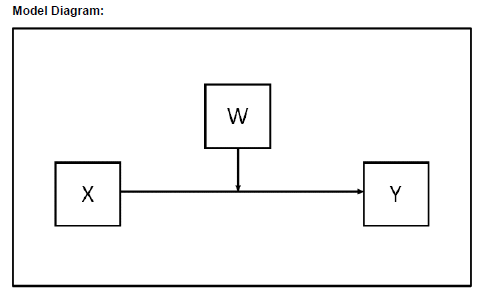
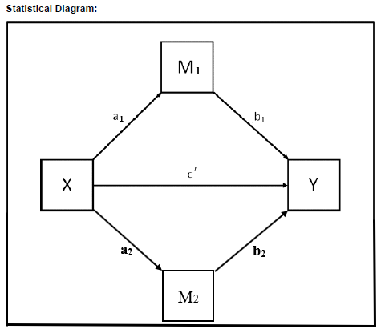
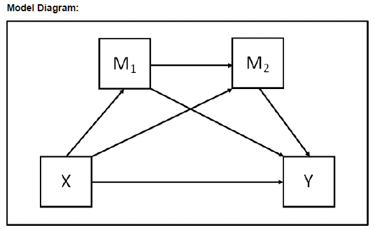
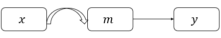
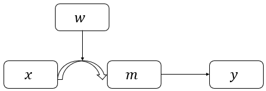
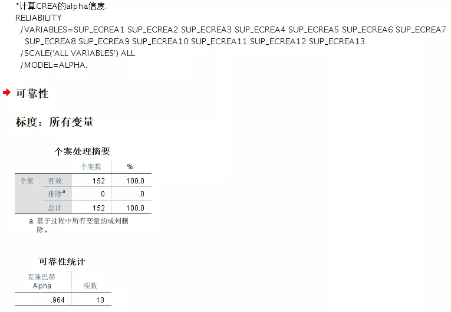

# 调节与中介分析 {#mome}

```{r setup, include=FALSE}
knitr::opts_chunk$set(echo = TRUE)
library(tidyverse) # Wickham的数据整理的整套工具
pdf.options(height=10/2.54, width=10/2.54, family="GB1") # 注意：此设置要放在最后
```

## 线性关系 {#linear}

### 调节与中介效果的检验步骤 {#momesteps}

自[@Baron1986:RNG]关于调节与中介效果的检验经典文章以来，调节与中介效果的检验已经非常成熟，甚至现在有所谓的调节的中介与中介的调节。

社会科学尤其是管理学，未来以后肯定会有大的方法上的突破，现有的管理学研究范式已经进入了相对瓶颈期。鉴于目前国内期刊上很多关于中介与调节的检验不是很正确，下文给出相对正确的检验步骤。

**调节效果的检验步骤**：

* 第一步，如果有控制变量，先放入控制变量与结果变量进行回归；
* 第二步，将自变量与控制变量一起与结果变量进行回归；
* 第三步，将控制变量、自变量、调节变量一起与结果变量进行回归；
* 第四步，将控制变量、自变量、调节变量、自变量与调节变量的乘积项一起与结果变量进行回归，自变量与调节变量的乘积项显著，则调节作用存在。

需要注意的是：在验证调节作用时，通常需要将自变量与调节变量中心化以降低共线性的可能性。

**中介效果的检验步骤**：

最有效最直接也最简单的方法是使用Bootstrapping，诸如SPSS、Mplus等软件都可以轻易实现，便捷高效。

**以下列出我所认为相对不错的中文论文供大家参考**：

[1] 方杰, 张敏强, 李晓鹏. 中介效应的三类区间估计方法[J]. 心理科学进展, 2011, 19(5):765-774.

[2] 刘冰, 齐蕾, 徐璐. 棍棒之下出“孝子”吗——员工职场偏差行为研究[J]. 南开管理评论, 2017, 20(3):182-192.

[3] 芦谢峰, 韩立敏. 中介变量、调节变量与协变量——概念、统计检验及其比较[J]. 心理科学, 2007, 30(4):934-936.

[4] 温忠麟, 张雷, 侯杰泰. 有中介的调节变量和有调节的中介变量[J]. 心理学报, 2006, 38(3):448-452.

其中，刘冰等(2017)这篇文章关于调节与中介的检验较为标准，所以我列出供大家参照借鉴。


### 管理学研究常用调节效应检验Mplus Code {#mocode}

1. 只有一个调节变量




```
USEVARIABLE = X W Y XW;
DEFINE:
  XW = X*W;
ANALYSIS:
  TYPE = GENERAL;
  ESTIMATOR =  ML;
  BOOTSTRAP = 5000;
MODEL:
  [Y](b0);
  Y ON X(b1);
  Y ON W(b2);
  Y ON XW(b3);
MODEL CONSTRAINT:
  NEW(LOW_W HIGH_W SIMP_LO SIMIP_HI DIFF);
  LOW_W = #LOWW; ! replace #LOWW in the code with your chosen low value of W
  HIGH_W = #HIGHW; ! replace #HIGHW in the code with your chosen high value of W
! Now calculate simple slopes for each value of W
  SIMP_LO = b1 + b3*LOW_W;
  SIMP_HI = b1 + b3*HIGH_W;
  DIFF = SIMP_HI - SIMP_LO;
OUTPUTE:
  STAND CINT(bcbootstrap);
```

2. 存在两个并列的调节变量


```
USEVARIABLES = X W Y XW XZ;
DEFINE: 
  XW = X*W; 
  XZ = X*Z;
ANALYSIS: 
  TYPE = GENERAL; 
  ESTIMATOR = ML; 
  BOOTSTRAP = 5000;
MODEL:
  [Y](b0); 
  Y ON X(b1); 
  Y ON W(b2); 
  Y ON Z(b3); 
  Y ON XW(b4); 
  Y ON XZ(b5);
 MODEL CONSTRAINT: 
   NEW(LOW_W HIGH_W LOW_Z HIGH_Z LOW_LOZ HIW_LOZ LOW_HIZ HIW_HIZ DIFF1 DIFF2 DIFF3 DIFF4 DIFF5 DIFF6);
   LOW_W = #LOWW; ! replace #LOWW in the code with your chosen low value of W 
   HIGH_W = #HIGHW; ! replace #HIGHW in the code with your chosen high value of W
   LOW_Z = #LOWZ; ! replace #LOWZ in the code with your chosen low value of Z
   HIGH_Z = #HIGHZ; ! replace #HIGHZ in the code with your chosen high value of Z
 ! Now calc simple slopes for each value of W and Z
   LOW_LOZ = b1 + b4*LOW_W + b5*LOW_Z;
   HIW_LOZ = b1 + b4*HIGH_W + b5*LOW_Z;
   LOW_HIZ = b1 + b4*LOW_W + b5*HIGH_Z;
   HIW_HIZ = b1 + b4*HIGH_W + b5*HIGH_Z;
   DIFF1 = LOW_LOZ - HIW_LOZ;
   DIFF2 = LOW_LOZ - LOW_HIZ;
   DIFF3 = LOW_LOZ - HIW_HIZ;
   DIFF4 = HIW_LOZ - LOW_HIZ;
   DIFF5 = HIW_LOZ - HIW_HIZ;
   DIFF6 = LOW_HIZ - HIW_HIZ;
OUTPUT: 
  STAND CINT(bcbootstrap);
```

3. 调节的调节效应


```
USEVARIABLES = X W Y XW XZ WZ XWZ;
DEFINE: 
  XW = X*W; 
  XZ = X*Z; 
  WZ = W*Z; 
  XWZ = X*W*Z;
ANALYSIS: 
  TYPE = GENERAL; 
  ESTIMATOR = ML; 
  BOOTSTRAP = 5000;
MODEL: 
  [Y] (b0); 
  Y ON X(b1); 
  Y ON W(b2); 
  Y ON Z(b3); 
  Y ON XW(b4); 
  Y ON XZ(b5); 
  Y ON WZ(b6); 
  Y ON XWZ(b7);
  MODEL CONSTRAINT: 
  NEW(LOW_W HIGH_W LOW_Z HIGH_Z LOW_LOZ HIW_LOZ LOW_HIZ HIW_HIZ DIFF1 DIFF2 DIFF3 DIFF4 DIFF5 DIFF6);
  LOW_W = #LOWW; ! replace #LOWW in the code with your chosen low value of W
  HIGH_W = #HIGHW; ! replace #HIGHW in the code with your chosen high value of W
  LOW_Z = #LOWZ; ! replace #LOWZ in the code with your chosen low value of Z
  HIGH_Z = #HIGHZ; ! replace #HIGHZ in the code with your chosen high value of Z
! Now calc simple slopes for each value of W and Z
  LOW_LOZ = b1 + b4*LOW_W + b5*LOW_Z + b7*LOW_W*LOW_Z;
  HIW_LOZ = b1 + b4*HIGH_W + b5*LOW_Z + b7*HIGH_W*LOW_Z;
  LOW_HIZ = b1 + b4*LOW_W + b5*HIGH_Z + b7*LOW_W*HIGH_Z;
  HIW_HIZ = b1 + b4*HIGH_W + b5*HIGH_Z + b7*HIGH_W*HIGH_Z;
   DIFF1 = LOW_LOZ - HIW_LOZ;
   DIFF2 = LOW_LOZ - LOW_HIZ;
   DIFF3 = LOW_LOZ - HIW_HIZ;
   DIFF4 = HIW_LOZ - LOW_HIZ;
   DIFF5 = HIW_LOZ - HIW_HIZ;
   DIFF6 = LOW_HIZ - HIW_HIZ;
OUTPUTE:
  STAND CINT(bcbootstrap);
```

### 常见中介效应 {#normme}

**重点**：

首先介绍只有一个中介变量的单中介模型；然后介绍具有多个中介变量的并列中介模型；最后介绍具有多个中介变量的中介链模型。

需要说明的是，以上中介效应模型的分类名称是我结合自身的理解命名，大家可能不太熟悉，明白就好。比如`链式中介`、`连续中介`等，其实就是我所阐述的`中介链`。

开始之前，还想结合阅读的文献以及自己的理解，想跟大家阐述一下间接效应与中介效应的区别。

简言之，间接效应(Indirect Effect)实质上等同于中介效应(Mediation Effect)。只不过提及间接效应的假设时，通常不会提主效应(X→Y)，只会提X→M→Y的关系假设。此外，心理统计类论文通常只会出现indirect effect，而不会出现mediation effect。~~我的推测是，当有direct effect的说法后，说indirect effect可能更直觉。~~

1. 单中介模型的Mplus code


```
USEVARIABLES = X M Y;

ANALYSIS:
  TYPE = GENERAL;
  ESTIMATOR = ML;
  BOOTSTRAP = 10000;

! In model statement name each path using parentheses
MODEL:
  Y ON M (b1);
  Y ON X (cdash); ! direct effect of X on Y
  M ON X (a1);
! Use model constraint to calculate indirect and total effect
  MODEL CONSTRAINT:
  NEW(a1b1 TOTAL);
    a1b1 = a1*b1; ! Indirect effect of X on Y via M
    TOTAL = a1*b1 + cdash; ! Total effect of X on Y

OUTPUT:
  STAND CINT(bcbootstrap);
```

2. 并列中介模型的Mplus code

以常见的双重并列中介为例：




```
USEVARIABLES = X M1 M2 Y;

ANALYSIS:
  TYPE = GENERAL;
  ESTIMATOR = ML;
  BOOTSTRAP = 10000;

! In model statement name each path using parentheses
MODEL:
  Y ON M1 (b1);
  Y ON M2 (b2);
  Y ON X (cdash); ! direct effect of X on Y
  M1 ON X (a1);
  M2 ON X (a2);
! Use model constraint to calculate indirect and total effect
  MODEL CONSTRAINT:
  NEW(a1b1 a2b2 TOTAL);
    a1b1 = a1*b1; ! Indirect effect of X on Y via M1
    a2b2 = a2*b2; ! Indirect effect of X on Y via M2
    TOTAL = a1*b1 + a2*b2 + cdash; ! Total effect of X on Y

OUTPUT:
  STAND CINT(bcbootstrap);
```

3. 中介链模型的Mplus code





```
USEVARIABLES = X M1 M2 Y;

ANALYSIS:
  TYPE = GENERAL;
  ESTIMATOR = ML;
  BOOTSTRAP = 10000;

! In model statement name each path usingparentheses
MODEL:
  Y ON X (cdash); ! direct effect of X on Y
  Y ON M1 (b1);
  Y ON M2 (b2);
  M1 ON X (a1);
  M2 ON X (a2);
  M2 ON M1 (d1);
! Use model constraint to calculate specific indirectpaths and total indirect effect
  MODEL CONSTRAINT:
  NEW(a1b1 a2b2 a1d1b2 TOTALIND TOTAL);
    a1b1 = a1*b1; ! Specific indirect effect of X on Y via M1
    a2b2 = a2*b2; ! Specific indirect effect of X on Y via M2
    a1d1b2 = a1*d1*b2; ! Specific indirect effect of X on Y via M1 andM2
    TOTALIND = a1*b1 + a2*b2 + a1*d1*b2; ! Total indirect effect of X onY via M1, M2
    TOTAL = a1*b1 + a2*b2 + a1*d1*b2 + cdash; ! Total effect of X on Y

OUTPUT:
  STAND CINT(bcbootstrap);
```

### 第一阶段有调节的中介、第二阶段有调节的中介、两阶段有调节的中介 {#firstmome}

本文主要介绍了第一阶段有调节的中介效应(first-stage moderated mediation)、第二阶段有调节的中介效应(second-stage moderated mediation)和两阶段有调节的中介效应(dual-stage moderated mediation)的统计学原理，并将统计学逻辑通过Mplus软件写出Code出来。

通过一份原始数据，手把手带你写出上述的三类有调节的中介效应。原始数据和Mplus Code在文末的链接中。

1 第一阶段有调节的中介效应

1.1 原理

第一阶段有调节的中介效应是指$x$→$m$→$y$的中介效应被调节变量$w$所调节了，且调节效应发生在$x$→$m$之间。概念模型如下图所示：


首先构建方程(1)：

$$
m=a_{0}+a_{1}x+a_{2}w+a_{3}xw(1)
$$

其次构建方程(2)：

$$
y=b_{0}+b_{1}m+c^{'}x(2)
$$

将方程(1)带入(2)：

$$
y=b_{0}+b_{1}(a_{0}+a_{1}x+a_{2}w+a_{3}xw)+c^{'}x(3)
$$

整理得：

$$
y=(b_{0}+a_{0}b_{1}+a_{2}b_{1}w)+(a_{1}b_{1}+a_{3}b_{1}w+c^{'})x
$$

我们只关心一次项系数$a_{1}b_{1}+a_{3}b_{1}w+c^{'}$，其中$a_{1}b_{1}+a_{3}b_{1}w$就是第一阶段有调节的中介效应，系数$c^{'}$是$x$→$y$的直接效应。

本质上，第一阶段有调节的中介效应可以通过偏导数求得：

首先对方程(1)求偏导：

$$
\frac{\partial m}{\partial x}=a_{1}+a_{3}w
$$

对方程(2)求偏导: 

$$
\frac{\partial y}{\partial x}=b_{1}
$$

所以第一阶段有调节的中介效应为：

$$
\frac{\partial m}{\partial x} {\times} \frac{\partial y}{\partial x}=(a_{1}+a_{3}w)b_{1}
$$

1.2 实例

研究假设模型如下：


Depressed Affect在Economic Stress和Withdrawal
Intentions中起中介作用，Entrepreneurial self-efficacy扮演了第一阶段的有中介的调节作用。

`关于本文所用原始数据来源说明`：

estress.sav和estress.csv，Mplus以estress.csv进行分析。原始数据来源于：

Pollack, J. M., Vanepps, E. M., & Hayes, A. F. The moderating role of social ties on entrepreneurs’ depressed affect and withdrawal intentions in response to economic stress[J]. Journal of Organziational Behavior, 2012, 33: 789-810.

因为作者提供的原始数据与文章有出入，所以我根据本推文所要解决的问题分别构建了三个研究假设模型。可能结果不会显著，但我只是利用数据来练习本文所要阐述的研究方法。

原始数据的变量如下：

| 变量类型| 描述| 
|:------|:-----------|
| 控制变量| tenure sex age |
| 自变量  | estress(Economic Stress,其中心化变量为estress_mc) |
| 调节变量| ese(Entrepreneurial self-efficacy,其中心化变量为ese_mc) |
| 中介变量| affect(Depressed Affect,其中心化变量为affect_mc) |
| 因变量  | withdraw(Withdrawal Intentions) |

其他两个所构建的假设模型使用的数据也是这一数据。

关于原始数据中的`控制变量`：

控制变量的作用在于控制一些潜在的因素对你所要探究的变量所造成的影响。其实，控制变量既可以对中介变量进行回归(即认为控制变量会对中介变量产生影响)，也可以对因变量进行回归(即认为控制变量会对因变量产生影响)。到底对中介变量还是因变量回归，是根据理论和你的argument所决定的。

在接下来的分析中，我将原始数据中的控制变量认为会对中介变量造成影响。

Mplus软件对应第一阶段有调节的中介效应语法如下：

```
TITLE: first-stage moderated mediation;

DATA: FILE = estress.csv;

VARIABLE:
NAMES = tenure estress affect withdraw sex age ese estress_mc affect_mc ese_mc;

USEVAR = tenure sex age estress_mc affect_mc withdraw ese_mc interaction; !放入新生成变量

DEFINE:     !定义交互项
interaction = estress_mc*ese_mc; 

ANALYS:
TYPE = GENERAL;
ESTIMATOR = ML;
BOOTSTRAP = 1000;

MODEL:
affect_mc ON tenure
             sex
             age
             estress_mc(a1)
             ese_mc(a2)
             interaction(a3);

withdraw ON affect_mc(b1);
            estress_mc;

withdraw ON affect_mc(b1);
            estress_mc;

MODEL CONSTRAINT:
NEW(LOW HIGH DIFF);
LOW = (a1 + a3*(-0.94464))*b1;     !调节变量为低时
HIGH = (a1 + a3*0.94464)*b1;       !调节变量为高时
DIFF = HIGH - LOW;

OUTPUT:
SAMPSTAT STDYX CINTERVAL(BCBOOTSTRAP);
```

输出结果如下：


我们主要关心画红线处新生成的三个参数的显著性，可以看出在ese_mc为低时，estress_mc→affect_mc→withdraw的中介效应显著(Index=0.218, p<0.001)；在ese_mc为高时，estress_mc→affect_mc→withdraw的中介效应不显著(Index=0.051, p>0.1)；ese_mc为高和为低时，中介效应的差异显著(Index=-0.167, p<0.1)。

一般情况下，我们比较关心上述结果的95%置信区间，在下图中体现：


然后，我们可以将需要的结果复制到EXCEL中进行整理，然后再粘贴到Word中，形成期刊所需要的格式。

2 第一阶段有调节的中介效应

2.1 原理

第二阶段有调节的中介效应是指$x$→$m$→$y$的中介效应被调节变量$w$所调节了，且调节效应发生在$m$→$y$之间。概念模型如下图所示：


首先构建方程(1)：

$$
m=a_{0}+a_{1}x(1)
$$

其次构建方程(2)：

$$
y=b_{0}+b_{1}m+b_{2}w+b_{3}mw+c^{'}x(2)
$$

将方程(1)带入(2)：

$$
y=b_{0}+b_{1}(a_{0}+a_{1}x)+b_{2}w+b_{3}(a_{0}+a_{1}x)w+c^{'}x(3)
$$

整理得：

$$
y=(b_{0}+a_{0}b_{1}+b_{2}w+a_{0}b_{3}w)+(a_{1}b_{1}+a_{1}b_{3}w+c^{'})x
$$

我们只关心一次项系数$a_{1}b_{1}+a_{1}b_{3}w+c^{'}$，其中$a_{1}b_{1}+a_{1}b_{3}w$=$a_{1}(b_{1}+b_{3}w)$就是第二阶段有调节的中介效应，系数$c^{'}$是$x$→$y$的直接效应。

本质上，第二阶段有调节的中介效应可以通过偏导数求得：

首先对方程(1)求偏导：

$$
\frac{\partial m}{\partial x}=a_{1}
$$

对方程(2)求偏导: 

$$
\frac{\partial y}{\partial x}=b_{1}+b_{3}w
$$

所以第二阶段有调节的中介效应为：

$$
\frac{\partial m}{\partial x} {\times} \frac{\partial y}{\partial x}=a_{1}(b_{1}+b_{3}w)
$$

2.2 实例

研究假设模型如下：


Depressed Affect在Economic Stress和Withdrawal Intentions中起中介作用，Entrepreneurial self-efficacy扮演了第二阶段的有中介的调节作用。

Mplus软件对应第二阶段有调节的中介效应语法如下：

```
TITLE: second-stage moderated mediation;

DATA: FILE = estress.csv;

VARIABLE:
NAMES = tenure estress affect withdraw sex age ese estress_mc affect_mc ese_mc;

USEVAR = tenure sex age estress_mc affect_mc withdraw ese_mc interaction; !定义新生成变量

DEFINE:      !定义交互项
interaction = affect_mc*ese_mc;

ANALYS:
TYPE = GENERAL;
ESTIMATOR = ML;
BOOTSTRAP = 1000;

MODEL:
affect_mc ON tenure
             sex
             age
             estress_mc(a1);

withdraw ON affect_mc(b1)
            ese_mc(b2)
            interaction(b3)
            estress_mc;

MODEL CONSTRAINT:
NEW(LOW HIGH DIFF);
LOW = a1*(b1 + b3*(-0.94464));       !当调节变量为低时
HIGH = a1*(b1 + b3*(0.94464));       !当调节变量为高时
DIFF = HIGH - LOW;

OUTPUT:
SAMPSTAT STDYX CINTERVAL(BCBOOTSTRAP);
```

输出结果如下：


由上面的两张图片的结果可以看出，在ese_mc为低时，estress_mc→affect_mc→withdraw的中介效应显著(Index=0.110, p<0.01)，95%CI=[0.048, 0.183]；在ese_mc为高时，estress_mc→affect_mc→withdraw的中介效应显著(Index=0.152, p<0.001), 95%CI=[0.089, 0.243]；ese_mc为高和为低时，中介效应的差异不显著(Index=0.042, p>0.1), 95%CI=[-0.018, 0.116]。

3 第一阶段有调节的中介效应

3.1 原理

第二阶段有调节的中介效应是指$x$→$m$→$y$的中介效应被调节变量$w$所调节了，且调节效应发生在$x$→$m$和$m$→$y$之间。概念模型如下图所示：


首先构建方程(1)：

$$
m=a_{0}+a_{1}x+a_{2}w+a_{3}xw(1)
$$

其次构建方程(2)：

$$
y=b_{0}+b_{1}m+b_{2}w+b_{3}mw+c^{'}x(2)
$$

将方程(1)带入(2)：

$$
y=b_{0}+b_{1}(a_{0}+a_{1}x+a_{2}w+a_{3}xw)+b_{2}w+b_{3}(a_{0}+a_{1}x+a_{2}w+a_{3}xw)w+c^{'}x(3)
$$

整理得：

$$
y=(b_{0}+a_{0}b_{1}+a_{2}b_{1}w+b_{2}w+a_{0}b_{3}w+a_{2}b_{3}w^{2})+(a_{1}b_{1}+a_{3}b_{1}w+a_{1}b_{3}w+a_{3}b_{3}w^{2}+c^{'})x
$$

我们只关心一次项系数$a_{1}b_{1}+a_{3}b_{1}w+a_{1}b_{3}w+a_{3}b_{3}w^{2}+c^{'}$，其中，$a_{1}b_{1}+a_{3}b_{1}w+a_{1}b_{3}w+a_{3}b_{3}w^{2}$=$(a_{1}+a_{3}w)(b_{1}+b_{3}w)$是两阶段有调节的中介效应，系数$c^{'}$是$x$→$y$的直接效应。

本质上，两阶段有调节的中介效应可以通过偏导数求得：

首先对方程(1)求偏导：

$$
\frac{\partial m}{\partial x}=a_{1}+a_{3}w
$$

对方程(2)求偏导: 

$$
\frac{\partial y}{\partial x}=b_{1}+b_{3}w
$$

所以两阶段有调节的中介效应为：

$$
\frac{\partial m}{\partial x} {\times} \frac{\partial y}{\partial x}=(a_{1}+a_{3}w)(b_{1}+b_{3}w)
$$

3.2 实例

研究假设模型如下：


Depressed Affect在Economic Stress和Withdrawal Intentions中起中介作用，Entrepreneurial self-efficacy扮演了两阶段的有中介的调节作用。

Mplus软件对应两阶段有调节的中介效应语法如下：

```
TITLE: dual-stage moderated mediation;

DATA: FILE = estress.csv;

VARIABLE:
NAMES = tenure estress affect withdraw sex age ese estress_mc affect_mc ese_mc;

USEVAR = tenure sex age estress_mc affect_mc withdraw ese_mc int1 int2; !放入新生成变量

DEFINE:       !定义交互项
int1 = estress_mc*ese_mc;
int2 = affect_mc*ese_mc;

ANALYS:
TYPE = GENERAL;
ESTIMATOR = ML;
BOOTSTRAP = 1000;

MODEL:
affect_mc ON tenure
             sex
             age
             estress_mc(a1)
             ese_mc(a2)
             int1(a3);

withdraw ON affect_mc(b1)
            ese_mc(b2)
            int2(b3)
            estress_mc;

MODEL CONSTRAINT:
NEW(LOW HIGH DIFF);
LOW = (a1+a3*(-0.94464))*(b1+b3*(-0.94464));     !调节变量为低时
HIGH = (a1 + a3*0.94464) * (b1 + b3*0.94464);    !调节变量为高时
DIFF = HIGH - LOW;

OUTPUT:
SAMPSTAT STDYX CINTERVAL(BCBOOTSTRAP);
```

结果输出如下：


由上面的两张图片的结果可以看出，在ese_mc为低时，estress_mc→affect_mc→withdraw的中介效应显著(Index=0.189, p<0.01)，95%CI=[0.084, 0.330]；在ese_mc为高时，estress_mc→affect_mc→withdraw的中介效应不显著(Index=0.061, p>0.1), 95%CI=[-0.045, 0.163]；ese_mc为高和为低时，中介效应的差异不显著(Index=-0.128, p>0.1), 95%CI=[-0.342, 0.020]。

本小节涉及的数据和语法存放在[此处](https://pan.baidu.com/s/18CvdyI59eLxmkC-_8bDrcA)，提取码：t3jc

### 单层次有中介的调节效应 {#memo}

本小节的Mplus语法参考于[@liudong2012:StochProc]。

1 Tpye I Mediated Moderation

1.1 统计方程式


$$
m=a_{0}+a_{1}x+a_{2}w+a_{3}xw(1)
$$

$$
y=b_{0}+b_{1}x+b_{2}m+b_{3}w+b_{4}xw(2)
$$

将(1)带入(2)，整理得：

$$
y=(b_{0}+a_{0}b_{2})+(b_{1}+a_{1}b_{2})x+(a_{2}b_{2}+b_{3})w+(b_{4}+a_{3}b_{2})xw(3)
$$

其中，$b_{4}$为调节效应，$a_{3}b_{2}$为有中介的调节效应。

1.2 在Mplus中的实现

```
TITLE:
Tpye I Mediated Moderation;

DEFINE:
xw=(x-3)*(w-4); !x和w的中心化后的相互项 
centering x(grandmean); 
centering m(grandmean); 
centering w(grandmean); 

DATA:
file = example.csv;

VARIABLE:
names = x m w y;
usevar = x m w y xw;

ANALUSIS：
bootstrap = 10000;

MODEL:
m on x w
     xw(a);
y on m(b)
     x w xw;

MODEL CONSTRAINT:
new(ind);
ind = a*b;

OUTPUTE:
sampstat;
cinterval(bcbootstrap);
```
2 Tpye II Mediated Moderation

2.1 统计方程式


```
TITLE:
Tpye II Mediated Moderation;

DEFINE:
xw=(x-3)*(w-4); !x和w的中心化后的相互项 
xm=(x-3)*(m-2.5); !x和m的中心化后的相互项 
centering x(grandmean); 
centering m(grandmean); 
centering w(grandmean); 

DATA:
file = example.csv;

VARIABLE:
names = x m w y;
usevar = x m w y xw xm;

ANALUSIS：
bootstrap = 10000;

MODEL:
m on w(a)
     x;
y on xm(b)
     m x w xw;

MODEL CONSTRAINT:
new(ind);
ind = a*b;

OUTPUTE:
sampstat;
cinterval(bcbootstrap);
```

## 非线性关系 {#nonlinear}

### 有调节的倒U型效应

有调节的倒U型概念模型如下所示：


1. 构建方程(1)：

$$
y=b_{0}+b_{1}x+b_{2}x^{2}(1)
$$

2. 加入调节变量$w$后，构建方程(2):

$$
y=b_{0}+b_{1}x+b_{2}x^{2}+b_{3}w+b_{4}xw+b_{5}x^{2}w(2)
$$

如果系数$b_{5}$为负且显著，那么倒U型调节效应成立。 

整理(2)式，得:

$$
y=(b_{0}+b_{3}w)+(b_{1}+b_{4}w)x+(b_{2}+b_{5}w)x^{2}(3)
$$

如果需要画出抛物线的调节效应图，只需要在(3)式中，将$w$取两个不同的数值(一般为均值加减一个标准差)，分别构建两个方程，就可以在Excel中绘制出来了。这与线性的调节效应图的绘制逻辑类似。

此外，我们通常需要计算inflection point=$-\frac{b_{1}+b_{4}w}{2(b_{2}+b_{5}w)}$和conditional simple slope(即下面的$\theta$)的显著性。

$$
\theta=\frac{\partial y}{\partial x}=b_{1}+b_{4}w+2(b_{2}+b_{5}w)x
$$

$\theta$是$y$关于$x$的偏导数，即$x$改变1个单位时，  $y$改变了多少。

当$w$取高和低不同的值时候，the shift of the inflection point = $(-\frac{b_{1}+b_{4}w_{高}}{2(b_{2}+b_{5}w_{高})})$ - $(-\frac{b_{1}+b_{4}w_{低}}{2(b_{2}+b_{5}w_{低})})$

本小节内容参考了[@Lin2017:RNG]和[@Hu2019:RNG]相关内容。


### 有调节的倒U型中介效应

有调节的倒U型中介效应

1. U型关系

$$
y=b_{0}+b_{1}x+b_{2}x^{2}(1)
$$

方程(1)的系数$b_{2}$显著，$y$对$x$的非线性关系成立。在显著的情形下，如果$b_{2}$为负，那么为倒U型关系；如果$b_{2}$为正，即为U型关系。下面所谈及的倒U型效应的图大致是这样的：


知道了这的确是一条抛物线关系后，我们还想进一步地知道：

inflection point=$-\frac{b_{1}}{2b_{2}}$的显著性,这将会告诉我们: 当$x$小于$-\frac{b_{1}}{2b_{2}}$时,$y$是上升的趋势；当$x$大于 $-\frac{b_{1}}{2b_{2}}$时,$y$是下降的趋势。通过inflection point，我们可以大致了解抛物线的形状。

2. 第一阶段倒U型中介效应



首先构建方程：

$$
m=a_{0}+a_{1}x+a_{2}x^{2}(1)
$$

其次构建方程：

$$
y=b_{0}+b_{1}m+c^{'}_{1}x+c^{'}_{2}x^{2}(2)
$$

中介效应$\theta$为：

$$
\theta=\frac{\partial{m}}{\partial{x}}{\times}\frac{\partial{y}}{\partial{m}}=(a_{1}+2a_{2}x)b_{1}(3)
$$

根据(3)式，中介效应的大小还要取决于$m$。$m$分别取低和高不同的值，就可以得到不同的$\theta$。如果它们间存在显著差异，中介效应就可以得到验证。

3. 第二阶段倒U型中介效应


首先构建方程：

$$
m=a_{0}+a_{1}x(1)
$$

其次构建方程：
 
$$
y=b_{0}+b_{1}m+b_{2}m^{2}+c^{'}x(2)
$$

中介效应$\theta$为：

$$
\theta=\frac{\partial{m}}{\partial{x}}{\times}\frac{\partial{y}}{\partial{m}}=a_{1}(b_{1}+2b_{2}m)(3)
$$

根据(3)式，中介效应的大小还要取决于$m$。$m$分别取低和高不同的值，就可以得到不同的$\theta$。如果它们间存在显著差异，中介效应就可以得到验证。

4. 第一阶段有调节的倒U型中介效应



构建方程(1)：

$$
m=a_{0}+a_{1}x+a_{2}x^{2}(1)
$$

加入调节变量$w$后，构建方程(2):
 
$$
m=a_{0}+a_{1}x+a_{2}x^{2}+a_{3}w+a_{4}xw+a_{5}x^{2}w(2)
$$

构建方程(3):

$$
y=b_{0}+b_{1}m+c^{'}_{1}x+c^{'}_{2}x^{2}(3)
$$

由方程(2)和方程(3)可知:

$$
\frac{\partial m}{\partial x}{\times}\frac{\partial y}{\partial m}=(a_{1}+a_{4}w+2(a_{2}+a_{5}w)x)b_{1}
$$

所以第一阶段有调节的倒U型中介效应为:

$$
\theta=(a_{1}+a_{4}w+2(a_{2}+a_{5}w)x)b_{1}
$$

可以看出，第一阶段有调节的倒U型中介效应大小不仅取决于调节变量$w$，也取决于自变量$x$。如下表所示，我们需要分别取$w$和$x$的低和高的值，来判断第一阶段有调节的倒U型中介效应是否显著。

|    $w$|    $x$|$\theta$| 置信区间|  
|:------|:------|:------|:------|
|     低|     低| $\theta_{x低w低}$ | $\theta_{x低w低}$对应的置信区间|
|     低|     高| $\theta_{x低w高}$ | $\theta_{x低w高}$对应的置信区间|
|     高|     低| $\theta_{x高w低}$ | $\theta_{x高w低}$对应的置信区间|
|     高|     高| $\theta_{x高w高}$ | $\theta_{x高w高}$对应的置信区间|

显著的标准是：
 
* $\theta_{1}=\theta_{x低w高}-\theta_{x低w低}$显著；

* $\theta_{2}=\theta_{x高w高}-\theta_{x高w低}$显著；

* $\theta_{1}$与$\theta_{2}$的差异显著。


5. 第二阶段有调节的倒U型中介效应


构建方程(1)：

$$
m=a_{0}+a_{1}x(1)
$$

加入调节变量$w$后，构建方程(2):
 
$$
y=b_{0}+b_{1}m+b_{2}m^{2}+c^{'}x(2)
$$

构建方程(3):

$$
y=b_{0}+b_{1}m+b_{2}m^{2}+b_{3}w+b_{4}mw+b_{5}m^{2}w+c^{'}x(3)
$$

由方程(1)和方程(3)可知:

$$
\frac{\partial m}{\partial x}{\times}\frac{\partial y}{\partial m}=a_{1}(b_{1}+b_{4}w+2(b_{2}+b_{5}w)m)
$$

所以第一阶段有调节的倒U型中介效应为:

$$
\theta=a_{1}(b_{1}+b_{4}w+2(b_{2}+b_{5}w)m)
$$

可以看出，第一阶段有调节的倒U型中介效应大小不仅取决于调节变量$w$，也取决于自变量$m$。如下表所示，我们需要分别取$w$和$m$的低和高的值，来判断第一阶段有调节的倒U型中介效应是否显著。

|    $m$|    $w$|$\theta$| 置信区间|  
|:------|:------|:------|:------|
|     低|     低| $\theta_{x低w低}$ | $\theta_{x低w低}$对应的置信区间|
|     低|     高| $\theta_{x低w高}$ | $\theta_{x低w高}$对应的置信区间|
|     高|     低| $\theta_{x高w低}$ | $\theta_{x高w低}$对应的置信区间|
|     高|     高| $\theta_{x高w高}$ | $\theta_{x高w高}$对应的置信区间|

显著的标准是：
 
* $\theta_{1}=\theta_{x低w高}-\theta_{x低w低}$显著；

* $\theta_{2}=\theta_{x高w高}-\theta_{x高w低}$显著；

* $\theta_{1}$与$\theta_{2}$的差异显著。

本小节内容参考了[@Lin2017:RNG]和[@Hu2019:RNG]相关内容。


## 绘制调节效应图 {#modplot}

### SPSS+Mplus+Excel计算简单斜率并绘制调节效应图

本小节采用的数据来源于发表在Journal of Applied Psychology的文章[@Liu2020:RNG]。

本文主要follow原文的study 1。原文提供的数据是Stata格式，已转换成了SPSS格式数据。数据中变量的相关信息如下：

| 变量类型| 详细信息| 
|:------|:-----------|
| 控制变量| EMP_GENDER; EMP_AGE; EMP_EDU; EMP_TenSup |
| 自变量(的条目)| EMP_MC_mean (EMP_MC1; EMP_MC2; EMP_MC3) |
| 因变量(的条目)| SUP_ECREA_mean (SUP_ECREA1; SUP_ECREA2; SUP_ECREA3; SUP_ECREA4; SUP_ECREA5; SUP_ECREA6; SUP_ECREA7; SUP_ECREA8; SUP_ECREA9; SUP_ECREA10; SUP_ECREA11; SUP_ECREA12; SUP_ECREA13) |
| 调节变量(的条目)| EMP_SUPEL_mean (EMP_SUPEL1; EMP_SUPEL2; EMP_SUPEL3; EMP_SUPEL4; EMP_SUPEL5; EMP_SUPEL6; EMP_SUPEL7; EMP_SUPEL8; EMP_SUPEL9; EMP_SUPEL10) |

1. 利用SPSS的Syntax进行相关分析


如上表所示，相关分析表格中需要$\alpha$系数、均值、标准差和变量之间的相关系数。

在SPSS的语法中，计算变量的$\alpha$值语法为：

```
*计算MC的alpha信度.
RELIABILITY
  /VARIABLES=EMP_MC1 EMP_MC2 EMP_MC3
  /SCALE('ALL VARIABLES') ALL
  /MODEL=ALPHA.

*计算EL的alpha信度.
RELIABILITY
  /VARIABLES=EMP_SUPEL1 EMP_SUPEL2 EMP_SUPEL3 EMP_SUPEL4 EMP_SUPEL5 EMP_SUPEL6 EMP_SUPEL7 
    EMP_SUPEL8 EMP_SUPEL9 EMP_SUPEL10
  /SCALE('ALL VARIABLES') ALL
  /MODEL=ALPHA.

*计算CREA的alpha信度.
RELIABILITY
  /VARIABLES=SUP_ECREA1 SUP_ECREA2 SUP_ECREA3 SUP_ECREA4 SUP_ECREA5 SUP_ECREA6 SUP_ECREA7 
    SUP_ECREA8 SUP_ECREA9 SUP_ECREA10 SUP_ECREA11 SUP_ECREA12 SUP_ECREA13
  /SCALE('ALL VARIABLES') ALL
  /MODEL=ALPHA.
```

输出结果为：




变量的均值、标准差语法为：

```
*计算变量的均值和标准差.
DESCRIPTIVES VARIABLES=EMP_GENDER EMP_AGE EMP_EDU EMP_TenSup EMP_MC_mean EMP_SUPEL_mean 
    SUP_ECREA_mean
  /STATISTICS=MEAN STDDEV.
```

输出结果为：


变量之间的相关系数语法为：

```
*计算变量间的相关系数.
CORRELATIONS
  /VARIABLES=EMP_GENDER EMP_AGE EMP_EDU EMP_TenSup EMP_MC_mean EMP_SUPEL_mean SUP_ECREA_mean
  /PRINT=TWOTAIL NOSIG
  /MISSING=PAIRWISE.
```

输出结果为：


把上述结果复制到Excel中加以整理，然后再复制到WORD中，就可以得到类似原文的相关系数表了。在Excel中，我初步整理的结果如下：


2. 利用SPSS的Syntax进行层级回归分析

在进行层级回归分析前，首先对自变量和调节变量进行中心化。中心化可以有效减少自变量和调节变量的交互项与它们(自变量和调节变量)的共线性。关于中心化，一般是均值中心化，并且只有自变量和调节变量需要中心化，因变量是不需要中心化的(但中心化也没什么太大的问题，只不过没有必要这么做)。

SPSS的中心化语法为：

```
*计算变量MC和EL的均值.
AGGREGATE
  /OUTFILE=* MODE=ADDVARIABLES
  /BREAK=
  /MC_mean=MEAN(EMP_MC_mean) 
  /EL_mean=MEAN(EMP_SUPEL_mean).

*变量MC和EL进行均值中心化.
COMPUTE MC_mc=EMP_MC_mean-MC_mean.
COMPUTE EL_mc=EMP_SUPEL_mean-EL_mean.
EXECUTE.
```

接下来计算交互项：

```
*计算交互项.
COMPUTE INTERACTION=MC_mc*EL_mc.
EXECUTE.
```

然后就可以进行层级回归分析了：

```
*层级回归.
REGRESSION
  /MISSING LISTWISE
  /STATISTICS COEFF OUTS R ANOVA CHANGE
  /CRITERIA=PIN(.05) POUT(.10)
  /NOORIGIN 
  /DEPENDENT SUP_ECREA_mean
  /METHOD=ENTER EMP_GENDER EMP_AGE EMP_EDU EMP_TenSup
  /METHOD=ENTER EMP_GENDER EMP_AGE EMP_EDU EMP_TenSup MC_mc
  /METHOD=ENTER EMP_GENDER EMP_AGE EMP_EDU EMP_TenSup MC_mc EL_mc INTERACTION.
```

结果如下：


上述这张表主要是输出回归系数(原文的Model 2的截距项系数是6.27,这是变量未中心化的回归分析结果，但Model 3原文又采用了中心化后的回归分析结果。此处存疑)。

模型的$R^{2}$和$\triangle R^{2}$由下面这张表输出来：


把上述结果复制到Excel中加以整理，然后再复制到WORD中，就可以得到类似原文的层级回归分析表了。EXCEL中的初步整理如下：


3. 利用Mplus的Syntax进行简单斜率检验

3.1 原理

一般的线性回归方程为($w$为调节变量)： 

$$
y=b_{0}+b_{1}x+b_{2}w+b_{3}x{\times}w
$$

整理后可得：  

$$
y=(b_{0}+b_{2}w)+(b_{1}+b_{3}w)x
$$

所以$x$对$y$的影响在于系数$b_{1}+b_{3}w$是否显著，而这个系数并不是固定的，取决于$w$的大小。我们通常取$w$的均值加一个标准差和均值减一个标准差。即当$w_{high}=M_{w}+SD_{w}$和$w_{low}=M_{w}-SD_{w}$时，我们可以得到两个方程(两条直线)，只需要检验这两条直线斜率以及斜率的差异是否显著，就可以判断$w$在不同情形下$x$对$y$的影响是否显著。

其他软件进行简单斜率检验非常困难，但在Mplus中，很容易实现，且语法的书写逻辑非常流畅。

3.2 语法

首先将SPSS格式数据转换成.csv格式数据。Mplus的语法如下：

```
DATA: FILE = data.csv;

VARIABLE:
MISSING = ALL(-999);   !定义数据中的-999为缺失值,本数据中没有缺失值,但建议写

NAMES = SUP_ECREA1 SUP_ECREA2 SUP_ECREA3 SUP_ECREA4 SUP_ECREA5 SUP_ECREA6 SUP_ECREA7
SUP_ECREA8 SUP_ECREA9 SUP_ECREA10 SUP_ECREA11 SUP_ECREA12 SUP_ECREA13 EMP_MC1  
EMP_MC2  EMP_MC3  EMP_SUPEL1 EMP_SUPEL2 EMP_SUPEL3 EMP_SUPEL4  EMP_SUPEL5  
EMP_SUPEL6 EMP_SUPEL7 EMP_SUPEL8 EMP_SUPEL9  EMP_SUPEL10 EMP_AGE EMP_GENDER  
EMP_EDU  EMP_TenSup EMP_MC_mean EMP_SUPEL_mean SUP_ECREA_mean 
MC_mean  EL_mean  MC_mc EL_mc INTERACTION;

USEVAR = EMP_AGE EMP_GENDER  EMP_EDU  EMP_TenSup 
MC_mc EL_mc SUP_ECREA_mean INTERACTION;

ANALYSIS:
TYPE = GENERAL;
ESTIMATOR = ML;
BOOTSTRAP = 1000;     !bootstrap次数为1000

MODEL:
[SUP_ECREA_mean](b0);            !估计SUP_ECREA_mean的截距,系数为b0
SUP_ECREA_mean ON EMP_GENDER
                  EMP_AGE   
                  EMP_EDU  
                  EMP_TenSup 
                  MC_mc(b1)
                  EL_mc(b2)
                  INTERACTION(b3);

MODEL CONSTRAINT:
NEW(HIGH_SLOP LOW_SLOP DIFF H_INTERCEPT L_INTERCEPT);
HIGH_SLOP = b1 + b3*1.08996;        !调节变量取其均值加一个标准差(即1.08996)
LOW_SLOP = b1 + b3*(-1.08996);      !调节变量取其均值加一个标准差(即-1.08996)
DIFF = HIGH_SLOP - LOW_SLOP;        !可以理解为简单斜率检验

H_INTERCEPT = b0 + b2*1.08996;     !调节变量为HIGH时的截距
L_INTERCEPT = b0 + b2*(-1.08996);  !调节变量为LOW时的截距

OUTPUT:
!输出变量基本统计量,标准化系数,Boostrap置信区间,缺失值描述
SAMPSTAT STDYX CINTERVAL(BCBOOTSTRAP) PATTERNS;
```

解释下为什么需要计算两条直线的截距[H_INTERCEPT = b0 + b2 $\times$ 1.08996; L_INTERCEPT = b0 + b2 $\times$ (-1.08996)]。实际上我们根本不关心截距的显著性，但为了后续能够直观地写出方程(如果不让软件帮你计算截距项，你就得自己手工计算)，还是在语法中添加了计算截距项的语法。

至于调节变量的均值和标准差，可以在SPSS中完成，其语法为：

```
*计算中心化后的调节变量的均值和标准差.
DESCRIPTIVES VARIABLES=EL_mc
  /STATISTICS=MEAN STDDEV.
```

Mplus的输出结果如下：


以上结果表明，当EL高时，斜率*B* = -0.149, *p* > 0.1，即不显著；当EL低时，斜率*B* = -0.457, *p* < 0.001。这与原文报告的结果一致。


我们还可以查看两条直线斜率的偏差校正的置信区间：


4. 利用Excel绘制调节效应图

至少50%的人只使用了Excel的50%的功能。Excel对数据结果的整理非常友善，我们以Mplus输出的两条直线在Excel中绘制调节效应图。逻辑很简单，我们已经有了当调节变量(EL)为高和低时的两条直线，接下来我们只需要在Excel中画出这两条直线就可以了。


根据上述Mplus的输出结果，我们可以知道：


当EL=1.08996(调节变量为高情形,因为EL进行了中心化,所以均值为0)时，直线方程为：

CREAT=5.659-0.149*MC

当EL=-1.08996(调节变量为低情形)时，直线方程为：

CREAT=4.687-0.457*MC

两点确定一条直线，因为原文是李克特7点量表，所以就选取MC=1和MC=7两点，带入方程后求得对应的CREAT值。

选取好了点后，我们就可以在Excel中绘图了。效果如下：


在Excel中进行操作的静音视频如下，帮助大家理解绘制的过程：

<iframe width="560" height="315"
src="https://www.bilibili.com/video/BV1ga4y1e7wZ" frameborder="0" allow="accelerometer; autoplay; encrypted-media; gyroscope; picture-in-picture" allowfullscreen></iframe>

本小节的数据存放在[此处](https://pan.baidu.com/s/1gxaa4SfN4IKnMy3bydmuXQ)，提取码：ugmh


### 利用R作调节效应图


