# 元分析 {#meta}

```{r setup, include=FALSE}
knitr::opts_chunk$set(echo = TRUE)
library(tidyverse) # Wickham的数据整理的整套工具
pdf.options(height=10/2.54, width=10/2.54, family="GB1") # 注意：此设置要放在最后
```

## 手把手的元分析实战 {#meta-practice}

在开始之前，首先设置R的工作路径：

```
setwd("C:/Users/ASUS/Desktop/meta data")
```

工作路径设置在桌面的`meta data`文件夹里。
接下来读取文件夹下面的`dat.csv`数据，以`dat`命名：

```
dat <- read.csv("dat.csv", header=TRUE)
```

然后加载元分析过程中使用的R包，如果没有安装，请事先运用`install.package()`函数安装：

```
library("robumeta")
library("metafor")
library("dplyr")
```

下面，开始正式进入元分析的操作过程。


### 主效应检验

首先，通过FisherZ转换，将每个研究的相关系数r转化成z：

```
dat <- escalc(measure="ZCOR", ri=ri, ni=ni, data=dat, 
              slab=paste(authors, year, sep=", ")) 
```

主要运用了`metafor`包中的`escalc`函数：`measure`指定转换的类型；`ri`指定元分析数据中的原始相关系数；`ni`指定元分析中的每个研究的样本大小；`slab`是可选择的研究标签。
现在，我们可以查看通过`FisherZ`转换后的`z`值：

```
View(dat)
```

我们运用随机效应模型来进行估计：

```
res <- rma(yi, vi, data=dat, method="REML") 
```

查看结果：

```
res
```

输出结果如下：

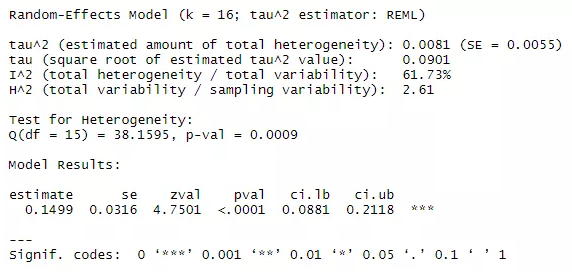

Q=38.1596，p=0.0009,说明存在异质性。进一步地，我们可以输出异质性相关估计量的95%置信区间：

```
confint(res)
```

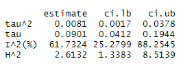

$\tau^{2}$、$I^{2}$和$H^{2}$的结果都表明元分析结果具有高度的异质性。

通过下面的代码将`z`还原成`r`，计算总体的平均加权后的相关系数(结果保留4位小数)：

```
predict(res, digits=4, transf=transf.ztor)
```

结果如下：

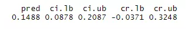

示例数据的研究问题是探究conscieniousness和medication adherence之间是否具有显著相关，并检验背后是否存在可能的调节变量。

所以，conscieniousness和medication adherence的相关性为0.1488, 95%CI=[0.0878, 0.2087]。

当然，如果在没有异质性的前提下，我们需要运用固定效应模型进行估计：

```
fes <- rma(yi, vi, data=dat, method="FE") 
fes
predict(fes, digits=4, transf=transf.ztor)
```

###  Bajaut plot和forest plot

在知道元分析结果具有较大异质性后，我们可以进一步利用Bajaut plot可视化异质性结果，查看哪些研究具有较大的异质性：

```
#根据study_id进行标记
b_res <- rma(yi, vi, data=dat, slab=study_id)  
baujat(b_res)
```

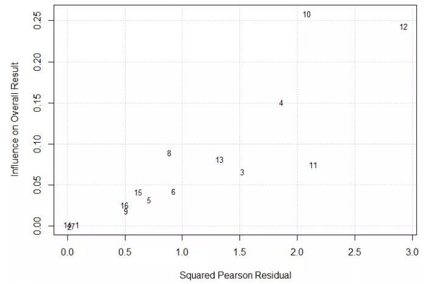

简单来说，越靠近图形的右上方的点，表明异质性的贡献就越高。从上图可以看出，研究4、研究10、研究12贡献程度较高。

接下来利用forest plot(森林图)可视化元分析的每个研究的影响大小：

```
forest(res, xlim=c(-1.6,1.6), atransf=transf.ztor,
       at=transf.rtoz(c(-.4,-.2,0,.2,.4,.6)), digits=c(3,1), cex=.8)
```

其中`xlim`: 图形水平方向的限制; `at`: 横轴坐标及标签定义参数; `digits`:本示例中是用来保留估计值和置信区间数值3位小数 刻度线1位小数; `cex`:控制字体的大小。

还可以进一步美化森林图，在顶部添加作者,年份和相关系数标签：

```
text(-1.6, 18, "Author(s), Year", pos=4, cex=.8)
text( 1.6, 18, "Correlation [95% CI]", pos=2, cex=.8)
```

绘制出的森林图如下：

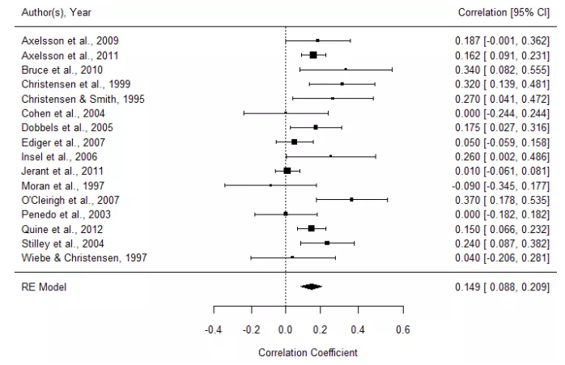

垂直于刻度0的虚线称之为"无效应线"。越靠近这条线，说明研究的效应越小。"无效应线"的左边效应为负，右边为正。从上图可以看出，利用随机效应模型估计的总体效应为0.149， 95%CI=[0.088, 0.209]。

### 出版偏倚的检验

**3.1 利用funnel plot(漏斗图)主观判断是否存在出版偏倚**

```
funnel(res, xlab = "Correlation coefficient")
```

输出的图形如下：

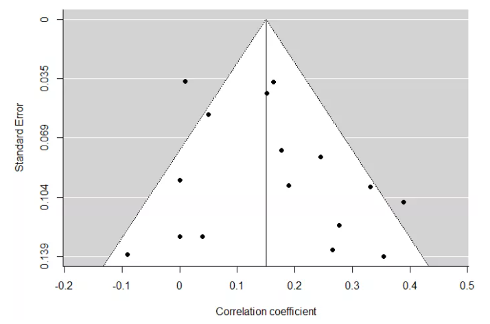

在上图中，左右两边的点基本对称，基本可以判断不存在出版偏倚。

**3.2 利用统计方法检查是否存在出版偏倚**

```
regtest(res)    #Egger's回归检验
ranktest(res)   #秩相关检验

#失安全系数 默认为Rosenthal
#表明还需要纳入210项研究才会使结果变得不显著，该值远大于纳入的研究数量，
#因此可以认为不存在发表偏倚，或即使存在发表偏倚，对本研究结果的影响也较小
fsn(yi, vi, data=dat, type="Rosenberg")  
```

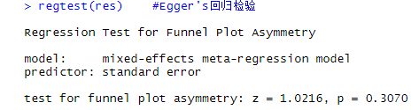

Egger回归分析表明，不存在出版偏倚(p>0.05)。

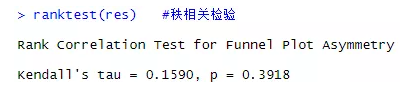

Begg秩相关检验表明，不存在出版偏倚(p>0.05)。

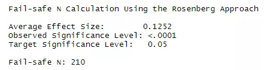

失安全系数检验表明，需要再纳入210项研究，元分析结果才会变得不显著。该值远大于元分析所用的样本量(16)，所以可认为不存在出版偏倚，或即使存在，影响也很小。

**3.3 当漏斗图出现偏倚的可能性后，可以运用剪补法(Trim and fill)法进行改进**

由于本研究分析结果没有出版偏倚，所以重新输入一份数据进行演示：

```
dat_bias <- read.csv("dat_bias.csv") 
View(dat_bias)
```

相关系数的分析：

```
res.b <- rma(yi, vi, data=dat_bias) 
res.b 
confint(res.b)  
```

出版偏倚检验:

```
funnel(res.b, xlab = "Correlation coefficient") #漏斗图
regtest(res.b)  #Egger线性回归
ranktest(res.b) #Begg秩相关检验
```

运用剪补法填补缺失值，去生成对称的漏斗图:

```
res.tf <- trimfill(res.b)
res.tf
funnel(res.tf, xlab = "Correlation coefficient")
```

结果如下：

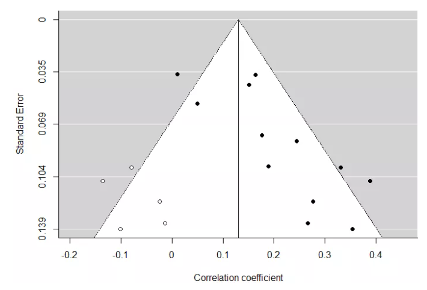

上图中，白色的5个圆点是补进去的研究，当补进去这5个研究后，才不会出现出版偏倚情形。


### 调节效应分析

**4.1 使用元回归模型(meta-regression model)进行分析**

通常适用于调节变量为连续型变量。以下判断age是否是可能的调节变量：

```
res.modage <- rma(yi, vi, mods = ~ meanage, data=dat) 
res.modage 
```

输出结果如下：

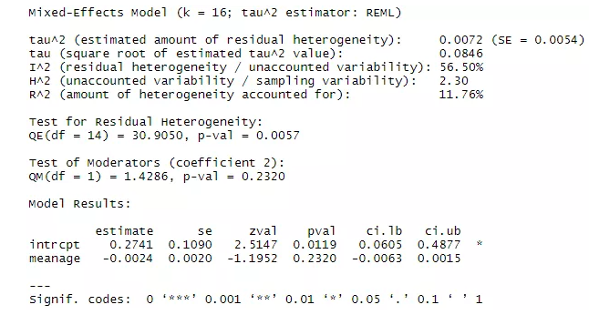

调节变量age的P值为0.2320，因此调节效应不成立。

**4.2 使用亚组比较分析**

通常适用于调节变量为分类型变量。以下判断quanlity是否是可能的调节变量：

```
res.modq1 <- rma(yi, vi, data=dat, subset=(quality=="1")) 
res.modq2 <- rma(yi, vi, data=dat, subset=(quality=="2")) 
res.modq3 <- rma(yi, vi, data=dat, subset=(quality=="3"))
```

同步显示3个分组的结果：

```
res.modq <- rma(yi, vi, mods=~factor(quality)-1, data=dat)
res.modq
```

结果如下：

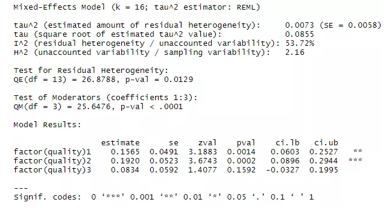

quanlity=1和2时，调节效应显著；quality=3时，调节效应不显著。但不知道总体而言是否显著。所以可以将元回归模型和亚组比较分析相结合全面了解显著状况。

**4.3 元回归模型和亚组比较分析相结合**


一般是先用元回归模型检验调节效应是否显著，其次利用亚组比较分析检验每组显著与否的具体情况。以下检验分类变量controls的调节效应：

```
#元回归模型
res.mes <- rma(yi, vi, mods = ~ factor(controls), data=dat) 
res.mes 


#亚组分析
res.mesnone <- rma(yi, vi, data=dat, subset=(controls=="none")) 
res.mesmultiple <- rma(yi, vi, data=dat, subset=(controls=="multiple")) 

res.mes <- rma(yi, vi, mods = ~ factor(controls)-1, data=dat) 
res.mes 
```

元回归模型结果如下：

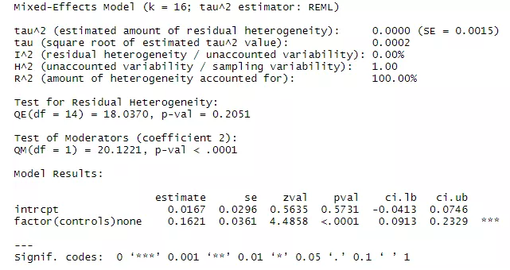

由上图可以看出，controls调节效应是显著的(P<0.001)。所以我们接下来想要了解每组的显著情况，亚组比较分析结果如下：

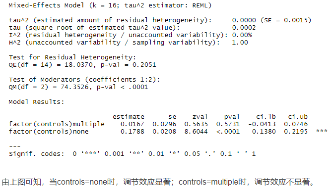


