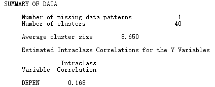
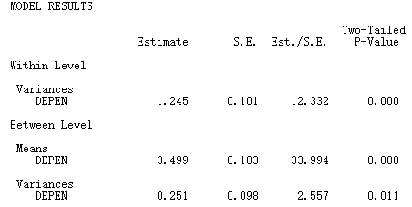
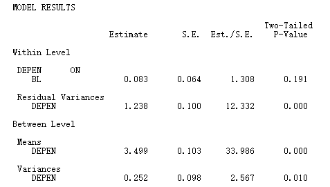
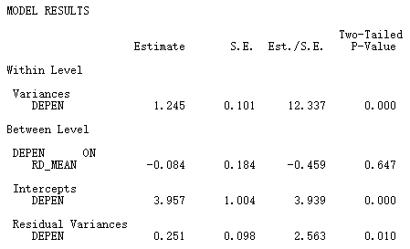
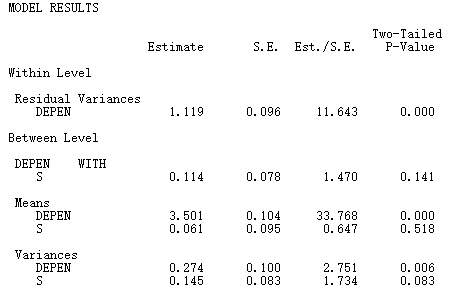
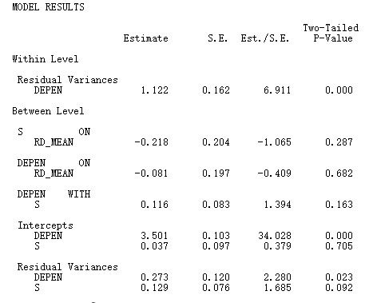
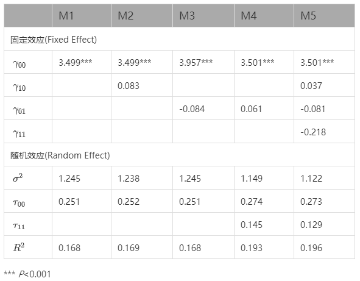

# 多层次线性回归模型 {#multilevel}


## 相关概念介绍 {#multiconcept}

当研究涉及到不同的层面时，我们可能就需要构建跨层模型来验证研究假设。比如当我们想要讨论员工个性(personality)和员工创造力(creativity)之间的关系时，个体层面的personality→creativity之间的关系可能会受到团队层面的团队氛围(team climate)的影响。 

较为常见的是两层线性模型。即使是三层线性模型，都不是很常见。以下以常见的两层线性模型为例。

1. 基本的两层线性模型阐述

第一层的方程：

$$
Y_{ij} = \beta_{0j} + \beta_{1j}X_{ij} + r_{ij}
$$

第二层的方程：

$$
\beta_{0j} = \gamma_{00} + \gamma_{01}W_j + u_{0j}
$$

$$
\beta_{1j} = \gamma_{10} + \gamma_{11}W_j + u_{1j}
$$

模型中的参数含义如下:

$\beta_{0j}$: 在第$j$组中，$X$对$Y$平均的影响(即截距)

$\beta_{1j}$: 在第$j$组中，当$X$改变一个单位时，$Y$的改变量

$r_{ij}$: 每一组中，$X$估计$Y$的误差(残差)

在第二层模型中，$\beta_{0j}$和$\beta_{1j}$是随着$j$的不同(组与组之间)而发生改变。$\beta_{0j}$和$\beta_{1j}$是随机的，而不是固定不变的(即第二层模型是`随机效应模型`)，改变的程度可用$W$来估计。而第一层的$\beta_{0j}$和$\beta_{1j}$是固定不变的，所以第一层模型被成为`固定效应模型`。

$\gamma_{00}$: $W_j$对$\beta_{0j}$(组内$X$对$Y$平均的影响)的平均影响

$\gamma_{01}$: 当$W_j$改变一个单位时，$\beta_{0j}$的改变量

$u_{0j}$: $W_j$估计$\beta_{0j}$的误差

$\gamma_{10}$: $W_j$对$\beta_{1j}$(组内$X$对$Y$的影响)的平均影响

$\gamma_{11}$: 当$W_j$改变一个单位时，$\beta_{1j}$的改变量

$u_{1j}$: $W_j$估计$\beta_{1j}$的误差


一般的线性回归方程($Y=\beta_0+\beta_1X$)中，我们一般只关注一次项系数($\beta_1$)的显著性，因为截距项($\beta_0$)一般来说没有意义。但当$X$中心化(例如均值中心化：$X-\bar{X}$)后，$\beta_0$意味着$X$对$Y$的平均影响。这也就解释了为什么$\beta_{0j}$是在第$j$组中，$X$对$Y$平均的影响，实际上我们是默认为方程进行了中心化。

随之而来的一个问题是：跨层回归方程中如何进行中心化(centering)？中心化主要有两个目的：一是避免产生不合理的解释；二是避免共线性问题。在多层回归分析中，主要有总平均值中心化(Grand Mean Centering,$x-\bar{x}_{ij}$,$\bar{x}_{ij}$是所有数据的平均数 )和分组平均值中心化(Group Mean Centering,$\bar{x}_{.j}$是第$j$组的$x_{ij}$值的平均数)。

简言之，在第一层的方程中，我们希望进行组内中心化，主要有以下几个好处：一是小组之间截距($\beta_{0j}$)的方差=小组平均数($\bar{y}_{.j}$)的方差，这就方便了第二层中$\gamma_{00}$的理解($\gamma_{00}$就是第二层变量$W_j$对每一组的$\bar{y}_{.j}$的影响)；二是区别开了组内效应和组间效应，组内效应是在第一层估计，组间效应就留给第二层估计。第一层采用分组平均值中心化后，第二组其实也就不太需要进行中心化了。所以，我们一般会把基本的$HLM$表述为：

$$
\left\{ \begin{aligned} 
        Y_{ij} = \beta_{0j} + \beta_{1j}(X_{ij} - \bar{X}_{.j}) + r_{ij} \\
        \beta_{0j} = \gamma_{00} + \gamma_{01}W_j + u_{0j} \\
         \beta_{ij} = \gamma_{10} + \gamma_{11}W_j + u_{1j}   
\end{aligned} \right.
$$

论文中也有采用第一层和第二层都是总平均值中心化的，第一层分组平均值中心化第二层总平均值中心化的。其实从统计上来说，都没有太大问题。实际上我们一般只关注回归系数的显著性。


2. 统计检验

* 验证$u_{0j}$=0.讨论$W_j$是否有足够能力去解释$\beta_{0j}$(组间的截距)的差异。当$u_{0j}$=0时，表示$W_j$可以解释组间的截距的所有差异。$u_{0j}$服从$\chi$分布。  

* $W_j$与$\beta_{0j}$的关系。通过验证回归系数的$t$检验来验证系数$\gamma_{00}$和$\gamma_{01}$是否显著。

* 类似地，可以通过验证$u_{1j}$=0.讨论$W_j$是否有足够能力去解释$\beta_{1j}$(组间的斜率)的差异，$u_{1j}$也服从$\chi$分布。同样也可以通过$t$检验来验证系数$\gamma_{10}$和$\gamma_{11}$的显著性($W_j$与$\beta_{1j}$的关系)。

3. 四种变化模型

完整的两层线性模型：

$$
\left\{ \begin{aligned} 
        Y_{ij} = \beta_{0j} + \beta_{1j}X_{ij} + r_{ij} \\
        \beta_{0j} = \gamma_{00} + \gamma_{01}W_j + u_{0j} \\
         \beta_{ij} = \gamma_{10} + \gamma_{11}W_j + u_{1j}   
\end{aligned} \right.
$$

3.1 变化之一：Model 1

$$
\left\{ \begin{aligned} 
        Y_{ij} = \beta_{0j} + r_{ij} \\
        \beta_{0j} = \gamma_{00} + u_{0j}       
\end{aligned} \right.
$$

$Y_{ij}$受三个因素影响： 

一个总平均($\gamma_{00}$);

一个随机的第二层效应($u_{0j}$);

一个随机的第一层效应($r_{ij}$)。

这实质上是方差分析($ANOVA$)。

3.2 变化之二：Model 2

$$
\left\{ \begin{aligned} 
        Y_{ij} = \beta_{0j} + \beta_{1j}X_{ij}+ r_{ij} \\
        \beta_{0j} = \gamma_{00} + u_{0j} \\
        \beta_{1j} = \gamma_{10}       
\end{aligned} \right.
$$

$Y_{ij}$受四个因素影响： 

一个总平均($\gamma_{00}$);

一个随机的第二层效应($u_{0j}$);

一个变量($X_{ij}$)的影响效应($\gamma_{10}$);

一个随机的第一层效应($r_{ij}$)。

这实质上是协方差分析($ANCOVA$)。

3.3 变化之三： Model 3

$$
\left\{ \begin{aligned} 
        Y_{ij} = \beta_{0j} + \beta_{1j}X_{ij}+ r_{ij} \\
        \beta_{0j} = \gamma_{00} \\
        \beta_{1j} = \gamma_{10}       
\end{aligned} \right.
$$

$Y_{ij}$受三个因素影响： 

一个总平均($\gamma_{00}$);

一个变量($X_{ij}$的影响效应($\gamma_{10}$);

一个随机的第一层效应($r_{ij}$)。

 Model 3中，第二层都是参数，所以其实就等同于一个单层的线性回归模型。

3.4 变化之四：Model 4

$$
\left\{ \begin{aligned} 
        Y_{ij} = \beta_{0j} + \beta_{1j}X_{ij}+ r_{ij} \\
        \beta_{0j} = \gamma_{00} + u_{0j} \\
        \beta_{1j} = \gamma_{10} + u_{1j}       
\end{aligned} \right.
$$

$Y_{ij}$受五个因素影响： 

一个总平均($\gamma_{00}$);

一个随机的第一层效应($r_{ij}$)；

一个随机的第二层效应($u_{0j}$);

一个变量($X_{ij}$)的影响效应($\gamma_{10}$);

一个随机的第二层效应($u_{1j}$)。

虽然Model 4看似是一个简单的线性回归方程，但因为分为两层，截距和回归系数可以在不同层面上发生改变。

4. $R_{wg}$和$ICC$的建议

$R_{wg}$和$ICC$都是判断能否进行分层线性回归模型分析的指标。

$R_{wg}$是组内评分者信度指标(within-group interrater reliability)，$j$一般是指构念量表的题目数量。它是判断低层面的变量是否有足够的信度上升(聚合)到高层面中去的依据。理论上来说，$R_{wg}$介于0和1之间，大于0.7较为理想。但实际操作中，也有可能出现小于0或大于1的现象。这种情况下，一般可将小于0的值视为0，大于1的值视为1[@law2014:StochProc]。

$ICC$是组内相关系数(intra-class correlation)，分为$ICC(1)$和$ICC(1)$。二者的区别简单来说是：$ICC(1)$是小组内不同成员的评分的信度；$ICC(2)$是小组的平均评分的信度。对于$ICC(2)$的理解，我们可以这样来看：当我们从$n$个组内随机从每个组内抽取$k$个成员，计算每一组的平均。理论上我们可以重复上述步骤再做一次。这样我们就会有两个样本，每个样本都有$n$个组，每个组有$k$个成员的平均分。$ICC(2)$就可以看成是这两个样本的$n$个平均的相关系数。通常来说，$ICC(1)$大于0.12、$ICC(2)$大于0.7较为合适。关于聚合建议值标准的阐述，希望可以引用相关的参考文献，这样比较有理有据。跨层分析的文献有很多，可以从中去引用。不一一赘述。


## HLM的R Square {#R2}

在普通的线性回归分析中，模型的$R^2$是判断模型好坏的非常有用的一个指标，它告诉我们模型中所有自变量到底能够解释因变量的多少方差。

但是在HLM中(以两层的线性回归模型为例)，Level 1是一个线性回归分析，Level 2是一个交叉在Level 1参数中的又一个线性回归分析。因此，当我们说自变量能解释因变量多少的方差时，就会显得很困惑。其实，HLM是没有模型的$R^2$的，我们一般所见的是所谓的"伪R平方"(pseudo  R-square)。

在探讨多层线性回归模型的伪R平方前，首先介绍一下普通线性回归模型中的R平方。

### 普通线性回归模型中的$R^2$  

普通的线性回归方程一般表示为： 

$$
y=b_0+b_1x+ \varepsilon
$$
其中，$\varepsilon$是自变量不能解释的部分，就是所谓的误差(或称残差)。$y$的$\varepsilon$等于$y$减去估计值$\hat{y}$。所以$y$离开它的平均值$\bar{y}$可以分解如下：

$$
y-\bar{y}=(\hat{y}-\bar{y})+(y-\hat{y})
$$
可以进一步整理：

$$
(y-\bar{y})^{2}=(\hat{y}-\bar{y})^{2}+(y-\hat{y})^{2}+2(\hat{y}-\bar{y})(y-\hat{y})
$$

所以在普通线性回归模型中有： 

$$
\sum(y-\bar{y})^{2}=\sum(\hat{y}-\bar{y})^{2}+\sum(y-\hat{y})^{2}+2\sum(\hat{y}-\bar{y})(y-\hat{y})
$$
在普通最小二乘法(OLS)分析下，$\sum(\hat{y}-\bar{y})(y-\hat{y})$=0。最终，可得到如下的方程：

$$
\sum(y-\bar{y})^{2}=\sum(\hat{y}-\bar{y})^{2}+\sum(y-\hat{y})^{2}
$$

在线性回归分析中，$\sum(y-\bar{y})^{2}$称为总平方和(total sum of square,$SS_{tot}$)，它其实等价于$y$的方差(只要再除以样本数$n$)。$\sum(\hat{y}-\bar{y})^{2}$称为回归的平方和(regression sum of square,$SS_{reg}$)，它是回归模型能够解释$y$变异的部分。$\sum(y-\hat{y})^{2}$称为残差的平方和(residual sum of square,$SS_{res}$)，它其实就是估计的误差，即模型不能解释$y$变异的部分。所以就会有： 

$$
SS_{tot}=SS_{reg}+SS_{res}
$$
模型的$R^2$就产生了：

$$
R^{2}={SS_{reg}\over{SS_{tot}}}
$$
它也被称为决定系数(coefficient of determination)。

### 多层线性回归模型中的伪$R^2$

在多层线性回归模型中，常用的方法是通过比较拟合模型的残差估计值和基准模型的残差估计值，在自变量加入后模型的残差减少比例得到的一个伪$R^2$。

基准模型(baseline model, M1)： 

$$
\begin{aligned} 
       y_{ij} = \beta_{0j} + r_{ij} \\
       \beta_{0j} = \gamma_{00} + u_{0j}  
\end{aligned}
$$
在模型M1基础上，增加一个第二层的自变量，成为模型M2： 

$$
\begin{aligned} 
       y_{ij} = \beta_{0j} + r_{ij} \\
       \beta_{0j} = \gamma_{00} +\gamma_{01}{\bar{x}_{.j}}+ u_{0j} 
\end{aligned}
$$
在模型M1基础上，增加一个第一层的自变量，成为模型M3：

$$
\begin{aligned} 
       y_{ij} = \beta_{0j} + \beta_{1j}(x_{ij}-\bar{x}_{.j}) +  r_{ij} \\
       \beta_{0j} = \gamma_{00} + u_{0j} \\
       \beta_{1j} = \gamma_{10} + u_{1j} 
\end{aligned}
$$

假设4个模型的分析结果如下：

|     变量|        方差|     M1|      M2|     M3|     M4|  
|:--------|:-----------|:------|:-------|:------|:------|
| $r_{ij}$|  $\sigma^2$|  39.15|   39.16|  36.71|  36.71| 
| $u_{0j}$| $\tau_{00}$|   8.62|    2.64|   8.68|   2.65| 
| $u_{1j}$| $\tau_{11}$|       |        |   0.68|   0.66| 

当比较基准模型M1的$\tau_{00}$时，则：

$$
比率一={\tau_{00}(M1)\over{\tau_{00}(M1)+\sigma^2(M1)}}=0.1804
$$
这代表$y$的误差方差中，有18%是由第二层产生的，有82%是由第一层产生的。

比较M1和模型M3的$\sigma^2$，有：

$$
比率二={\sigma^2(M1)-\sigma^2(M3)\over{\sigma^2(M1)}}=0.0623
$$
这代表$y$的方差中，自变量$x$解释了6%的方差。

比较M1和M2的$\tau_{00}$时，则有：

$$
比率三={\tau_{00}(M1)-\tau_{00}(M2)\over{\tau_{00}(M1)}}=0.6937
$$
这代表$y$的组间方差中，不同的小组解释了69%的变异。说明了$y$的方差主要是由自变量$x$的组间方差来解释，自变量的组内方差解释能力很低。 

比较M3和M4的$\tau_{00}$和$\tau_{11}$，有：

$$
\begin{aligned} 
比率四={\tau_{00}(M3)-\tau_{00}(M4)\over{\tau_{00}(M3)}}=0.6947 \\
比率五={\tau_{11}(M3)-\tau_{11}(M4)\over{\tau_{11}(M3)}}=0.0294
\end{aligned}
$$

这代表在加入了小组的$x$平均以后，解释了69%的截距的方差，但仅解释了3%的斜率的方差。

以上就是用在增加变量后减少误差的能力多少来估计伪$R^2$，这也是分析报告中较为常见的多层线性回归模型的$R^2$形式。


## 构建一个完整的HLM

### 利用SPSS计算$R_{wg}$  

关于$R_{wg}$的概念，前文已经详细阐述，此处不再赘述。SPss的语法如下：

```
*******************************************************************
*指定输出数据的存储位置，修改'H:\RwgOutcome.sav'，切勿将引号删除.
*根据数据文件中的分组变量对数据进行分组.
*需要修改的地方1：分组变量名称，请将Team修改为分组变量.
*需要修改的地方2：每一维度所包括的变量的名称，请将RD1,RD2,RD3,RD4,RD5,RD6……修改为您研究中该维度所包括的变量的名称.

AGGREGATE
 /OUTFILE='H:\RwgOutcome.sav'
 /BREAK=Team
 /sdx1=SD(RD1)
 /sdx2=SD(RD2)
 /sdx3=SD(RD3)
 /sdx4=SD(RD4)
 /sdx5=SD(RD5)
 /sdx6=SD(RD6).
EXECUTE.

*******************************************************************
*计算每一个变量的方差，即标准差的平方.
*需要修改的地方1：请根据维度所包括的变量的名称进行相应的修改.

GET FILE='H:\RwgOutcome.sav'.
COMPUTE varx1=sdx1*sdx1.
COMPUTE varx2=sdx2*sdx2.
COMPUTE varx3=sdx3*sdx3.
COMPUTE varx4=sdx4*sdx4.
COMPUTE varx5=sdx5*sdx5.
COMPUTE varx6=sdx6*sdx6.

COMPUTE mvar=MEAN(varx1,varx2,varx3,varx4,varx5,varx6).

COMPUTE nvar=6.
COMPUTE rwg=nvar*(1-(mvar/2))/(nvar*(1-(mvar/2))+mvar/2).
EXECUTE.

```

上述的语法是计算数据中的RD变量的$R_{wg}$。如果你要计算自己数据中变量的$R_{wg}$ ，只需要根据注释修改相应的部分就可以了。

运行SPSS的语法后，在H盘中，会得到名为`RwgOutcome.sav`的SPSS数据。从`RwgOutcome.sav`的输出结果可以看到，有一些$R_{wg}$的数值小于0，还有一些大于1。我们需要将小于0的数值视为0，大于1的数值视为1，生成调整后的$R_{wg}$，rwg_adjusted。SPSS的语法如下：

```
*=================NOTE=================== =.
*=========================================.
*计算调整后的Rwg. 如果Rwg小于0或大于1,则将小于0的值视为0，大于1的值视为1.

RECODE rwg (Lowest thru 0=0) (1 thru Highest=1) (ELSE=Copy) INTO rwg_adjusted.
EXECUTE.
```

所以，$R_{wg}$(即rwg_adjusted)的平均值和中位数分别为0.61和0.78。一般来说需要 $R_{wg}$的平均值和中位数越接近于1越好，一般建议值是大于0.7，就可以将低层面的变量聚合到高层次中去。因为RD的中位数大于0.7，所以有理由将其聚合(上升)到高层次中去。只需要依据分组变量(Team)，分别求出每组的均值就可以了，即RD_mean代表每组的RD。SPSS的语法如下：

```
AGGREGATE
  /OUTFILE=* MODE=ADDVARIABLES OVERWRITEVARS=YES
  /BREAK=Team
  /RD_mean=MEAN(RD).
```

### 利用Mplus计算ICC(1)

关于ICC(1)的介绍，前文已经比较详细，也不再阐述。之所以利用Mplus计算，主要也是因为ICC(1)的code也是多层线性模型的最基础模型(零模型, null model)，其实也就是one-way ANOVA(单因素方差分析)。Mplus Code如下：

```
TITLE: one-way ANOVA with random effects for depend;

DATA: FILE = study1.csv;

VARIABLE:
MISSING = ALL(-999);

NAMES = Team Name Gender_r Age EDU Marital
BL1 BL2 BL3 BL4 BL5 BL6 BL7 BL8 BL9 BL10 BL11
RD1 RD2 RD3 RD4 RD5 RD6
AL1 AL2 AL3 AL4 AL5 AL6 AL7 AL8 AL9
Depen1 Depen2 Depen3 Depen4 Depen5 Depen6
BL RD AL DEPEN RD_mean;

USEVAR = Team DEPEN;

CLUSTER = Team;

WITHIN =;

BETWEEN =;

ANALYSIS:
TYPE = TWOLEVEL;
ESTIMATOR = ML;

MODEL:
%WITHIN%
DEPEN;

%BETWEEN%
DEPEN;

OUTPUT:
SAMPSTAT;
```

输出结果主要看`Summary of Data`这部分：



当然，我们也可以通过Model Results的输出结果进行手工计算：



$ICC(1)={0.251\over{1.249+0.251}}=0.168$，表明组间的变异占总变异的16.8%。通常来说，ICC(1)大于0.12，就表示变量可能不仅受组内因素的影响，也会受到组间因素的影响。


### 一步步地构建完整的HLM模型

**(1)one-way ANOVA with random effects**

也就是零模型(单因素方差分析)，方程如下：

Level 1:

$$
DEPEN_{ij}=\beta_{0j}+r_{ij}
$$

Level 2:

$$
\beta_{0j}=\gamma_{00} +u_{0j}
$$

Mplus Code请见利用Mplus计算ICC(1)这一部分。通过输出结果可知：$\sigma^{2}$($r_{ij}$的方差)=1.245，$\tau_{00}$($u_{0j}$的方差)=0.251，$\gamma_{00}$=3.499。

**(2) one-way ANCOVA with random effects**

也就是协方差分析，方程如下：

Level 1: 

$$
DEPEN_{ij}=\beta_{0j}+ \beta_{1j}BL + r_{ij}
$$
Level 2:

$$
\begin{aligned} 
        \beta_{0j} = \gamma_{00} + u_{0j} \\
        \beta_{1j} = \gamma_{10}       
\end{aligned}
$$
Mplus Code如下：

```
TITLE: one-way ANCOVA with random effects for depend;

DATA: FILE = study1.csv;

VARIABLE:
MISSING = ALL(-999);

NAMES = Team Name Gender_r Age EDU Marital
BL1 BL2 BL3 BL4 BL5 BL6 BL7 BL8 BL9 BL10 BL11
RD1 RD2 RD3 RD4 RD5 RD6
AL1 AL2 AL3 AL4 AL5 AL6 AL7 AL8 AL9
Depen1 Depen2 Depen3 Depen4 Depen5 Depen6
BL RD AL DEPEN RD_mean;

USEVAR = Team BL DEPEN;

CLUSTER = Team;

WITHIN = BL;

BETWEEN =;

DEFINE:
CENTER BL(GROUPMEAN);

ANALYSIS:

TYPE = TWOLEVEL;
ESTIMATOR = ML;

MODEL:
%WITHIN%
DEPEN ON BL;

%BETWEEN%
DEPEN;

OUTPUT:
SAMPSTAT;
```

值得注意的是，第一层的自变量进行了分组平均值中心化(Group Mean Centering)。输出结果如下：



通过输出结果可知：$\sigma^{2}$=1.238，$\tau_{00}$=0.252；$\gamma_{00}$=3.499，$\gamma_{10}$=0.083。


### means-as-outcomes regression

即认为第一层的变量DEPEN会受到第二层的变量RD的影响。之所以会称之为均值为结果的回归，是因为变量DEPEN虽然是第一层的变量，但出现在第二层中，是将其均值与RD进行回归的(其实也就是截距$\beta_{0j}$)。方程如下：

Level 1: 

$$
DEPEN_{ij}=\beta_{0j}+ r_{ij}
$$

Level 2:

$$
\beta_{0j}=\gamma_{00}+ \gamma_{01}RD + u_{0j}
$$

Mplus Code如下：

```
TITLE: means-as-outcomes regression;

DATA: FILE = study1.csv;

VARIABLE:
MISSING = ALL(-999);

NAMES = Team Name Gender_r Age EDU Marital
BL1 BL2 BL3 BL4 BL5 BL6 BL7 BL8 BL9 BL10 BL11
RD1 RD2 RD3 RD4 RD5 RD6
AL1 AL2 AL3 AL4 AL5 AL6 AL7 AL8 AL9
Depen1 Depen2 Depen3 Depen4 Depen5 Depen6
BL RD AL DEPEN RD_mean;

USEVAR = Team DEPEN RD_mean;

CLUSTER = Team;

WITHIN =;

BETWEEN = RD_mean;

ANALYSIS:
TYPE = TWOLEVEL;
ESTIMATOR = ML;

MODEL:
%WITHIN%
DEPEN;

%BETWEEN%
DEPEN ON RD_mean;

OUTPUT:
SAMPSTAT;
```

输出结果如下：



通过输出结果可知：$\sigma^{2}$=1.245，$\tau_{00}$=0.251，$\gamma_{00}$=3.957，$\gamma_{01}$=-0.084。


### random-coefficients regression model

随机系数回归模型，即第一层回归方程的截距和系数不是固定不变的，而是在不同的组中是随机变化的。方程如下：

Level 1: 

$$
DEPEN_{ij}=\beta_{0j}+ \beta_{1j}BL + r_{ij}
$$
Level 2:

$$
\begin{aligned} 
        \beta_{0j} = \gamma_{00} + u_{0j} \\
        \beta_{1j} = \gamma_{10} + u_{1j}       
\end{aligned}
$$
Mplus Code如下：

```
TITLE: random-coefficients regression model;

DATA: FILE = study1.csv;

VARIABLE:
MISSING = ALL(-999);

NAMES = Team Name Gender_r Age EDU Marital
BL1 BL2  BL3  BL4  BL5  BL6  BL7 BL8 BL9 BL10 BL11
RD1 RD2  RD3  RD4  RD5 RD6
AL1 AL2 AL3 AL4 AL5 AL6 AL7 AL8 AL9
Depen1 Depen2 Depen3 Depen4 Depen5 Depen6
BL RD AL DEPEN RD_mean;

USEVAR = Team BL DEPEN;

CLUSTER = Team;

WITHIN = BL;

BETWEEN =;

DEFINE:
CENTER BL(GROUPMEAN);

ANALYSIS:
TYPE = TWOLEVEL RANDOM;
ESTIMATOR = ML;

MODEL:
%WITHIN%
S | DEPEN ON BL;

%BETWEEN%
DEPEN;
S;
DEPEN WITH S;

OUTPUT:
SAMPSTAT;
```

输出结果如下：



通过输出结果可知：$\sigma^{2}$=1.149，$\tau_{00}$=0.274，$\tau_{11}$=0.145；$\gamma_{00}$=3.501，$\gamma_{01}$=0.061。


### full model

第一层回归方程的截距和系数不是固定不变的，是随着第二层的自变量的变化而发生改变。方程如下：

Level 1: 

$$
DEPEN_{ij}=\beta_{0j}+ \beta_{1j}BL + r_{ij}
$$

Level 2:

$$
\begin{aligned} 
        \beta_{0j} = \gamma_{00} + \gamma_{01}RD + u_{0j} \\
        \beta_{1j} = \gamma_{10} + \gamma_{11}RD +u_{1j}       
\end{aligned}
$$

Mplus Code如下：

```
TITLE: full model;

DATA: FILE = study1.csv;

VARIABLE:
MISSING = ALL(-999);

NAMES = Team Name Gender_r Age EDU Marital
BL1 BL2 BL3 BL4 BL5 BL6 BL7 BL8 BL9 BL10 BL11
RD1 RD2 RD3 RD4 RD5 RD6
AL1 AL2 AL3 AL4 AL5 AL6 AL7 AL8 AL9
Depen1 Depen2 Depen3 Depen4  Depen5 Depen6
BL RD AL DEPEN RD_mean;

USEVAR = Team BL DEPEN RD_mean;

CLUSTER = Team;

WITHIN = BL;

BETWEEN = RD_mean;

DEFINE:
CENTER BL(GROUPMEAN);
CENTER RD_mean(GRANDMEAN);

ANALYSIS:
TYPE = TWOLEVEL RANDOM;
ESTIMATOR = MLR;

 MODEL:
%WITHIN%
S | DEPEN ON BL;

%BETWEEN%
DEPEN ON RD_mean;
S ON RD_mean;
DEPEN WITH S;

OUTPUT:
SAMPSTAT;
```

输出结果如下：



通过输出结果可知：$\sigma^{2}$=1.122，$\tau_{00}$=0.273，$\tau_{11}$=0.129；$\gamma_{00}$=3.501，$\gamma_{01}$=-0.081；$\gamma_{10}$=0.037，$\gamma_{11}$=-0.218。

值得说明的是，因变量没有指定隶属的层次，所以可在两个水平参与子模型的构建。在组间层次，即是随机截距($\beta_{0j}$)。实际上，因变量的Level-1的方程截距的随机变化，表现在组间的不同，方差存在于Level-2。

Level-1部分只会输出$\sigma^{2}$，因为其他的参数都是Level-2的要素，所以结果会呈现在Level-2部分。


### 整理汇报结果

将上述的5个回归模型输出结果整理成如下表所示：



注意的是，$R^2={组间误差的方差\over组间误差的方差+组内误差的方差}={\tau\over{\tau+\sigma^2}}$

组间误差的方差通常只考虑随机截距的误差方差($\tau_{00}$)，忽略随机斜率的误差方差(如$\tau_{11}$)。因为估计随机斜率$R^2$非常麻烦，而且纳入随机斜率后，$R^2$一般不会发生太大的变化。所以简单的方法是忽略随机斜率，以固定的部分，即随机截距估计  。

在实际建模的过程中，可以采取步进的策略，进行试验性的建模。至少要以零模型为基础，并通过模型比较检验，突出某些重点解释变量的作用。随机效应也是在固定效应显著之后才考虑加入的。

本小节涉及的数据和语法存放在[此处](https://pan.baidu.com/s/15Z6cio19QIGKxUWBcS90vA)，提取码：


