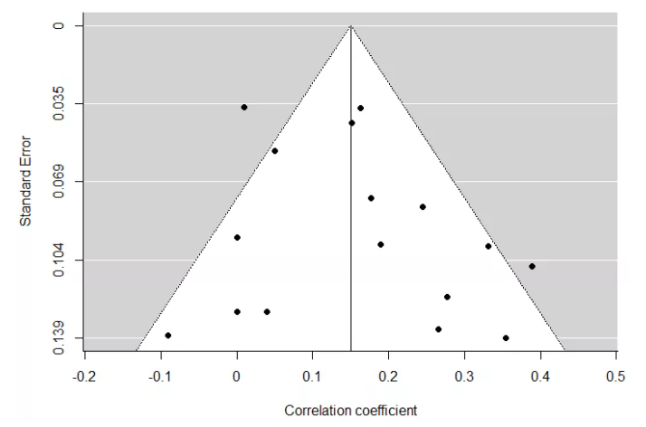

# 元分析 {#meta}


## 元分析中的常见概念及原理 {#meta-concept}

### 同质性检验

同质性检验回答的是不同的研究样本是否来自于同一个总体。如果所收集的文献中的研究样本来自于同一个总体，那么在接下来的分析中应当选用固定效应模型；如果不是来自于同一个总体，后续分析中应当选用随机效应模型。

从以上的论述中可以看出：固定效应模型(Fixed Effect Model)假设元分析中所包含的研究样本都来自于同一个样本总体。因为这个总体的平均效应值是固定的，所以来自这个总体的不同研究样本所得出的效应值在理论上应该也是同质(Homogeneous)的；随机效应模型(Random Effect Model)假设元分析中的研究样本是来自于不同的总体，由于不同总体存在不同的效应值，那么不同研究样本的效应值在理论上应该是异质的(heterogeneous)。

固定效应模型认为误差主要是由于同一总体的抽样误差所造成的；而随机效应模型则认为误差不仅存在于抽样误差，同时也包括不同总体间的效应值的差异。

**(1) 总体的相关系数($\rho$)与研究样本的抽样分布方差($S_e^2$)的关系** 

$$
S_e^2={(1-\rho^2)^2}\over{N-1}
$$

$S_e^2$是当我们从相关系数是$\rho$的总体中抽出样本数为$N$的样本时，不同样本的相关系数($r$)的概率分布的方差。


从上式可知，总体相关系数越大($r$)，样本的相关系数离总体的相关系数的差异($S_e^2$)就越小；样本量($N$)越大，样本的相关系数离总体的相关系数的差异($S_e^2$)就越小。

正是因为上述的原因，由于不同研究的样本量存在差异，虽然可能它们是来自于同一个总体，但我们观察到它们各自的样本相关系数都会不一样。

**(2) 同质还是异质？(是否存在调节变量)**

我们可以建立如下公式：

$$
S_\rho^2=S_r^2-S_e^2
$$

即总体相关系数的方差=观察到相关系数的方差-抽样误差引起的方差。

$S_r^2$是我们从不同的样本中观察到的不同的相关系数所形成的方差，为观察方差(observed variance)。

$S_\rho^2$是假设不同的样本是从不同的总体中抽出来的，不同的总体有不同的相关系数。所以，这些不同的总体相关系数就形成了方差，称之为真实方差(true variance)，其代表了不同总体中相关系数的真实差异。

而$S_e^2$代表假的方差(artifactual variance)，是由于抽样而产生的方差。

如果$S_\rho^2\leqslant0$，就代表总体中相关系数没有方差，即样本背后只有一个总体，也就是只有一个总体相关系数。在这种情况下，不同样本相关系数的差异，就完全是抽样误差所引起的。如果$S_\rho^2>0$,大致可以判断样本背后应该有不同的总体，不同的总体有不同的相关系数。

如果抽样方差能够解释观察方差的75%(${S_e^2\over{S_r^2}}\geqslant$ 75%)，就可以判断样本都是从同一个总体抽出来的，没有必要寻找可能的调节变量。如果${S_e^2\over{S_r^2}}$ < 75%，就有必要寻找是否有调节变量的存在。

**(2.1) $Q$统计量**

除去75%法则，$Q$统计量也可作为判断研究间是否存在异质性的依据，公式为： 

$$
Q=\sum_{i=1}^k(n_i-3)(z_i-z_+)^2
$$

其中，$z_{i}$是不同研究样本的相关系数，是用$FisherZ$转换成的$Z$值。$Z$值的计算公式为：

$$
FisherZ={1\over2}ln{(1+r)\over(1-r)}
$$

$z_+$是整个元分析的加权平均相关系数，是用$FisherZ$转换成的$Z$值。

$n_i$是不同研究的样本量。

$Q$统计量服从$\chi^2$分布。我们的零假设是总体中只有一个相关系数。如果$Q$统计量不显著，就代表在总体中只有一个相关系数，没有必要进一步寻找调节变量了。

**(2.2) $H$统计量**

进一步地,$H$检验是$Q$统计量的校正值。计算公式为： 

$$
H=\sqrt{Q\over{k-1}}
$$

其中，$k$是纳入研究的数量，如果$Q\over{k-1}$<1，则视$H$=1。

$H$=1表示研究间无异质性;$H$介于1.2和1.5之间，如果$H$值的95%CI包含1，则在0.05检验水平下无法确定是否存在异质性，若不包含1则认为存在异质性;$H$>1.5则表示研究间存在异质性。

**(2.3) $I^{2}$统计量**

$I^{2}$描述了研究间变异占总变异的百分比，计算公式为： 

$$
\left\{ \begin{aligned} 
        I^{2} = {{Q-df\over{Q}},Q>df} \\
        I^{2} = 0,{Q}\leqslant{df}
\end{aligned} \right.
$$

其中，$df$是$Q$统计量的自由度。当$I^2$=0%时，研究间无异质性；25%为轻度异质性；50%为中度异质性；75%为高度异质性。

### 发表偏倚检验

**(1) 漏斗图**

漏斗图(funnel plot)，是使用效应值和样本量作为坐标系，将各个研究绘制在坐标系里的散点图。对于样本量越大的研究样本来说，其效应值估计也就越准确，误差也越小。呈现在漏斗图中，样本量大的研究样本会集中在图的上方、平均效应值的周围；而样本量小的研究样本则会散落在漏斗图的底部，距离平均效应值较远。

具体来说，如果图形呈现一个倒着的漏斗形状，则表明发表偏差不太可能存在；如果漏斗图不对称，有缺角，则表明发表偏差可能存在。

漏斗图是一种主观的定性判断有无发表偏倚的方法，不同的人对漏斗图对称性可能会做出不同的判断。客观的统计检验方法主要有Begg秩相关检验和Egger's回归系数检验。

**(2) 剪补法**

剪补法(Trim and Fill)是将不对称的漏斗图中的研究样本进行删减，使其变成对称的漏斗，并对校正后的样本重新估计。基本过程主要包括：剪掉引起漏斗图中不对成的小样本研究；用修剪后的对称部分估计漏斗图的中心值；然后沿中心两侧添补被剪切的以及相应的估计缺失研究。剪补法既可以估计缺失研究的数目，也可以将缺失研究纳入重新进行Meta分析。

剪补法是基于发表偏倚会造成漏斗图不对称这一研究假设，采用迭代方法估计缺失研究的数量。其意义不是估计缺失研究的具体数目，而在于判断结果的稳健性。在添补一部分研究后，重新进行Meta分析。如果合并效应量估计值与剪补之前的变化不明显，说明发表偏倚不是很严重，结果比较稳健。

**(3) 失安全系数**

因为结果不显著的研究成果是很难发表的。在解释元分析的结果时, 应该充分考虑这种"发表偏倚"或"抽屉文件效应"(file-drawer effect, 指结果不显著的研究成果最终只能锁在抽屉里)。

失安全系数(fail-safe N, Nfs)，估计还需要存在多少未发表的研究才能将现有的研究结果从显著变得不显著。Nfs越大, 说明元分析的结果越稳定, 结论被推翻的可能性就越小。

**(4) 森林图和累积森林图**

森林图(forest plot)，让研究者"既见树木又见森林"。它有助于研究者正确解释分析结果，并能发现纳入研究的一些异常情况(如某个极端值)，可以视森林图为发表偏倚的初步视觉印象。

累积Meta分析是把纳入的研究作为一个连续的整体，将各个纳入的研究按一定的次序(如研究发表的时间、样本量大小、研究质量评分)，依次地加在一个研究上，进行多次Meta分析。每当有新的研究发表后，就可以进行一次Meta分析。累积Meta分析可以反映研究结果的动态变化趋势，有助于尽早发现有统计学意义的干预措施，同时也能被应用于评估发表偏倚或小样本研究对效应量估计产生的潜在影响。累积Meta分析作出来的森林图即是累积森林图。

### 敏感性分析

敏感性分析(Sensitivity Analysis)，是在一定条件下检验所获结果稳健性的方法，改变某些影响合并结果的重要性(如纳入标准、研究质量的高低、不同统计方法和不同效应量等)，重新进行Meta分析之后，与改变条件之前的Meta分析进行比较，观察前后是否发生变化。如果前后结果没有本质上改变(无改变或改变不大)，说明Meta分析结果较为可信；反之，则不太可信[@zhangyi2009:RNG]。

剪补法和失安全系数法其实就是两种常见的敏感性分析方法。

### 主效应检验

**(1) 如何计算效应值**

在固定效应模型中，首先通过$FisherZ$转换将每一个研究的相关系数$r$转换成$Z$值，转换后的$Z$值可以通过下面的公式计算加权平均效应值$\bar{Z_{r}}$：


$$
\bar{Z_r}=$\sum_{i=1}^k(n_i-3)FisherZ_i\over{\sum_{i=1}^k(n_i-3)}$
$$


其中，$1\over{n_i-3}$是计算的权重值，同时也是不同的研究样本内方差(Within-Study Variance)。 

而在随机效应模型中，不仅需要考虑研究样本内方差，同时也要考虑研究样本间方差(Between-Study Variance ,用$\tau^2$表示 )，计算公式为： 


$$
\tau^2={Q-(k-1)\over{\sum_{i=1}^k(n_i-3)-{\sum_{i=1}^k(n_i-3)^2\over{\sum_{i=1}^k(n_i-3)}}}}
$$


随机效应模型中的权重值$w_{i}$等于： 

$$
w_i={1\over{{1\over{n_i-3}}+\tau^2}}
$$

所以，随机效应模型的加权平均效应值$\bar{Z_{r}}$为： 

$$
\bar{Z_r}={\sum_{i=1}^kw_iFisherZ_i\over{\sum_{i=1}^kw_i}}
$$

**(2) 相对权重分析**

相对权重分析(relative weight analysis)能够通过数据转换、相关分析和回归分析，计算各自变量对因变量的独立作用[@xuyan2019:RNG]。

在进行元分析时，可以通过以往的元分析和实证研究结果，形成研究变量间的相关矩阵。通过相关矩阵，可以计算出相对权重。[@Lebreton2008:RNG]提供了SPSS语法，利用输入的相关矩阵计算相对权重。

### 调节效应检验

针对类别变量，通常采用分组比较分析(subgroup analysis)。分组比较在统计上通常来说具有更大的功效(power)。

针对连续型变量，主要采用加权回归分析(weighted regression analysis)。具体来说，把每个研究样本的效应值(或校正后的效应值)作为因变量，把潜在的调节变量作为自变量。与此同时，根据每个研究的样本量大小对每一个研究在回归分析中所占权重进行赋值。如果潜在调节变量对效应值的回归系数是显著的，那么就说明调节作用存在。如果有足够多的研究样本，建议采用加权回归分析方法。如果调节效应存在，可以进一步运用分组比较分析观察不同组的显著性。


## 手把手的元分析实战 {#meta-practice}

在开始之前，首先设置R的工作路径：

```
setwd("C:/Users/ASUS/Desktop/meta data")
```

工作路径设置在桌面的`meta data`文件夹里。
接下来读取文件夹下面的`dat.csv`数据，以`dat`命名：

```
dat <- read.csv("dat.csv", header=TRUE)
```

然后加载元分析过程中使用的R包，如果没有安装，请事先运用`install.package()`函数安装：

```
library("robumeta")
library("metafor")
library("dplyr")
```

下面，开始正式进入元分析的操作过程。


### 主效应检验

首先，通过FisherZ转换，将每个研究的相关系数r转化成z：

```
dat <- escalc(measure="ZCOR", ri=ri, ni=ni, data=dat, 
              slab=paste(authors, year, sep=", ")) 
```

主要运用了`metafor`包中的`escalc`函数：`measure`指定转换的类型；`ri`指定元分析数据中的原始相关系数；`ni`指定元分析中的每个研究的样本大小；`slab`是可选择的研究标签。
现在，我们可以查看通过`FisherZ`转换后的`z`值：

```
View(dat)
```

我们运用随机效应模型来进行估计：

```
res <- rma(yi, vi, data=dat, method="REML") 
```

查看结果：

```
res
```

输出结果如下：


Q=38.1596，p=0.0009,说明存在异质性。进一步地，我们可以输出异质性相关估计量的95%置信区间：

```
confint(res)
```


$\tau^{2}$、$I^{2}$和$H^{2}$的结果都表明元分析结果具有高度的异质性。

通过下面的代码将`z`还原成`r`，计算总体的平均加权后的相关系数(结果保留4位小数)：

```
predict(res, digits=4, transf=transf.ztor)
```

结果如下：


示例数据的研究问题是探究conscieniousness和medication adherence之间是否具有显著相关，并检验背后是否存在可能的调节变量。

所以，conscieniousness和medication adherence的相关性为0.1488, 95%CI=[0.0878, 0.2087]。

当然，如果在没有异质性的前提下，我们需要运用固定效应模型进行估计：

```
fes <- rma(yi, vi, data=dat, method="FE") 
fes
predict(fes, digits=4, transf=transf.ztor)
```

###  Bajaut plot和forest plot

在知道元分析结果具有较大异质性后，我们可以进一步利用Bajaut plot可视化异质性结果，查看哪些研究具有较大的异质性：

```
#根据study_id进行标记
b_res <- rma(yi, vi, data=dat, slab=study_id)  
baujat(b_res)
```


简单来说，越靠近图形的右上方的点，表明异质性的贡献就越高。从上图可以看出，研究4、研究10、研究12贡献程度较高。

接下来利用forest plot(森林图)可视化元分析的每个研究的影响大小：

```
forest(res, xlim=c(-1.6,1.6), atransf=transf.ztor,
       at=transf.rtoz(c(-.4,-.2,0,.2,.4,.6)), digits=c(3,1), cex=.8)
```

其中`xlim`: 图形水平方向的限制; `at`: 横轴坐标及标签定义参数; `digits`:本示例中是用来保留估计值和置信区间数值3位小数 刻度线1位小数; `cex`:控制字体的大小。

还可以进一步美化森林图，在顶部添加作者,年份和相关系数标签：

```
text(-1.6, 18, "Author(s), Year", pos=4, cex=.8)
text( 1.6, 18, "Correlation [95% CI]", pos=2, cex=.8)
```

绘制出的森林图如下：


垂直于刻度0的虚线称之为"无效应线"。越靠近这条线，说明研究的效应越小。"无效应线"的左边效应为负，右边为正。从上图可以看出，利用随机效应模型估计的总体效应为0.149， 95%CI=[0.088, 0.209]。

### 出版偏倚的检验

**3.1 利用funnel plot(漏斗图)主观判断是否存在出版偏倚**

```
funnel(res, xlab = "Correlation coefficient")
```

输出的图形如下：



在上图中，左右两边的点基本对称，基本可以判断不存在出版偏倚。

**3.2 利用统计方法检查是否存在出版偏倚**

```
regtest(res)    #Egger's回归检验
ranktest(res)   #秩相关检验

#失安全系数 默认为Rosenthal
#表明还需要纳入210项研究才会使结果变得不显著，该值远大于纳入的研究数量，
#因此可以认为不存在发表偏倚，或即使存在发表偏倚，对本研究结果的影响也较小
fsn(yi, vi, data=dat, type="Rosenberg")  
```


Egger回归分析表明，不存在出版偏倚(p>0.05)。


Begg秩相关检验表明，不存在出版偏倚(p>0.05)。


失安全系数检验表明，需要再纳入210项研究，元分析结果才会变得不显著。该值远大于元分析所用的样本量(16)，所以可认为不存在出版偏倚，或即使存在，影响也很小。

**3.3 当漏斗图出现偏倚的可能性后，可以运用剪补法(Trim and fill)法进行改进**

由于本研究分析结果没有出版偏倚，所以重新输入一份数据进行演示：

```
dat_bias <- read.csv("dat_bias.csv") 
View(dat_bias)
```

相关系数的分析：

```
res.b <- rma(yi, vi, data=dat_bias) 
res.b 
confint(res.b)  
```

出版偏倚检验:

```
funnel(res.b, xlab = "Correlation coefficient") #漏斗图
regtest(res.b)  #Egger线性回归
ranktest(res.b) #Begg秩相关检验
```

运用剪补法填补缺失值，去生成对称的漏斗图:

```
res.tf <- trimfill(res.b)
res.tf
funnel(res.tf, xlab = "Correlation coefficient")
```

结果如下：


上图中，白色的5个圆点是补进去的研究，当补进去这5个研究后，才不会出现出版偏倚情形。


### 调节效应分析

**4.1 使用元回归模型(meta-regression model)进行分析**

通常适用于调节变量为连续型变量。以下判断age是否是可能的调节变量：

```
res.modage <- rma(yi, vi, mods = ~ meanage, data=dat) 
res.modage 
```

输出结果如下：


调节变量age的P值为0.2320，因此调节效应不成立。

**4.2 使用亚组比较分析**

通常适用于调节变量为分类型变量。以下判断quanlity是否是可能的调节变量：

```
res.modq1 <- rma(yi, vi, data=dat, subset=(quality=="1")) 
res.modq2 <- rma(yi, vi, data=dat, subset=(quality=="2")) 
res.modq3 <- rma(yi, vi, data=dat, subset=(quality=="3"))
```

同步显示3个分组的结果：

```
res.modq <- rma(yi, vi, mods=~factor(quality)-1, data=dat)
res.modq
```

结果如下：


quanlity=1和2时，调节效应显著；quality=3时，调节效应不显著。但不知道总体而言是否显著。所以可以将元回归模型和亚组比较分析相结合全面了解显著状况。

**4.3 元回归模型和亚组比较分析相结合**


一般是先用元回归模型检验调节效应是否显著，其次利用亚组比较分析检验每组显著与否的具体情况。以下检验分类变量controls的调节效应：

```
#元回归模型
res.mes <- rma(yi, vi, mods = ~ factor(controls), data=dat) 
res.mes 


#亚组分析
res.mesnone <- rma(yi, vi, data=dat, subset=(controls=="none")) 
res.mesmultiple <- rma(yi, vi, data=dat, subset=(controls=="multiple")) 

res.mes <- rma(yi, vi, mods = ~ factor(controls)-1, data=dat) 
res.mes 
```

元回归模型结果如下：


由上图可以看出，controls调节效应是显著的(P<0.001)。所以我们接下来想要了解每组的显著情况，亚组比较分析结果如下：


