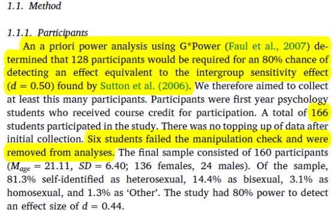
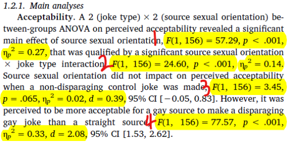
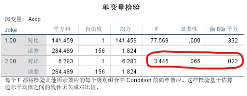
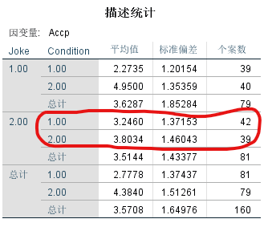
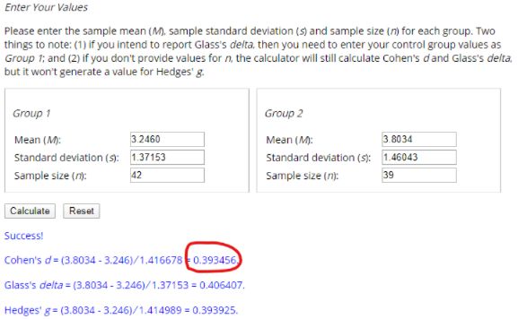
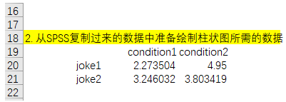
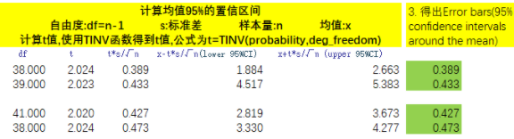

# 心理学与管理学中的实验分析：简介与实操 {#experiment}


在内容开始之前，想阐明一下研究设计的概念，这很重要。

研究设计是调查的计划和结构，用于得到问题的答案。一个好的研究设计通常需要达到两个目标：一是控制差异，二是确保效度。

`关于差异`。差异(variance)主要有系统变异(systematic variance)、外生变异(extraneous variance)和误差变异(error variance)。简单来说，系统变异是由于我们关心的变量导致的差异，外生变异是我们在研究中没有考虑到的因素产生的变异，误差变异是我们在研究设计中不能掌控的一种误差变异。在研究设计中，我们需要：最大化系统变异、控制外生变异和最小化误差变异。

`关于效度`。效度是测量的准确性，主要分为内部效度、统计结论效度和外部效度。内部效度是指结果是否真由假设原因所导致的；统计结论效度是以统计检验对假设的关系进行解释的可信度；而外部效度是假设的因果关系能否应用到对因果变量的其他测量方法，推广到不同类型的人(who)、环境(where)和时间(when)当中。

## 心理学研究中的实验法简单介绍 {#introduction}

### 基本原则：随机化与复制性

随机化是指实验材料(包括被试)在各个实验组之间的分配、被试的实验顺序是随机的。而复制是指在相同的处理下，独立重复实验能够得到类似的实验结果。随机化与复制性是统计分析的基础，同时也是实验高效度的保证。

### 常见内部效度威胁因素

**1. 被试选择偏差**

被试被主观意愿或者客观条件左右，进入到不同的实验组。

**2. 实验者偏差**

这是由于实验者本身的行为导致的偏差。

**3. 成熟程度**

随着年龄的增长，人们的心理和生理会逐渐成熟，进而对实验产生影响。

**4. 偶然减员**

在实验的进行过程中，一些被试可能会退出实验，进而可能会影响测试结果。

**5. 测试关联**

在测后测试(posttest)之前进行相关度比较高的测前测试(pretest)，这可能会使被试对实验更加熟悉和敏感，从而提高测试成绩。这时应该加入对照组。

### 常见外部效度威胁因素

**1. 样本不具代表性**

作为样本的被试不能代表总体的情况。

**2. 霍桑效应**

当研究人员存在时，由于紧张等原因，被试的表现会与平时表现得不一样，这会影响结果的外部效度。

**3. 需求特性**

被试在参与实验时会去猜测实验者的目的，从而在实验中能引导被试做出猜测的线索。

**4. 安慰剂效应**

被试即使没有真的接受实验，也会给出有效结果的反馈。

### 实验研究设计形式

**1. 组间设计**

即参加不同实验组的人是不同的。

**2. 组内设计**

即被试参与所有实验组。

**3. 因子设计**

即同时操控两个或两个以上的实验设计。

### 准实验研究

实验对象被随机分配到实验组和控制组，通常来说是不实际可行的。有一些研究在设计上可能比真正的实验的内部效度低一些，但仍可以在一定程度上支持因果推论，这种设计被成为准实验(quasi experiment)。简言之，准实验就是没有随机分配实验对象到实验组和控制组的实验。

### 实验研究中的常用方法及效应量(effect size)

**1. 检验**

t检验主要是用于检验两组之间的均值是否具有差异。主要分为单样本t检验(比较一组数据与一个特定数值之间的差异)、独立样本t检验(分析定类数据与定量数据之间的差异)、配对样本t检验(分析配对定量数据之间的差异对比关系)。

**2. 方差分析**

方差分析(Analysis of Variance, ANOVA)，主要用于两组及以上样本均值差异的显著性检验。在进行方差分析时，我们通常需要进行简单效应分析。因为交互效应显著时，我们不知道在何种条件下哪个实验组得分更高，因此需要控制一个变量的一个水平，比较另一个变量的各水平差异。

通过比较t检验和方差分析，我们就可以知道：当研究涉及到两组均值比较的时候，我们一般会选t检验；涉及两组及以上的时候，我们就要选择方差分析。

**3. 效应量**

效应量就是"效应"的大小。比如研究的是均值的比较，那么效应量就是均值的差异。无论你研究什么，你所研究的这个"效应"的大小就是effect size。效应量越大，就越容易把这个效应测出来，对应的"统计功效"(power)也就会越大。

在t检验中，如果要得到effect size，要基于得到的t值和样本的df进一步计算出cohen's $d$，$d$是t检验分析中常用的效应量。$d$通常的建议值是：0.20 较小，0.50中等，0.80较高。

在F检验中，$\eta_p^2$(Partial Eta Squared)是方差分析中常用的效应量。

在SPSS中，可以输出$\eta_p^2$。但无法输出$d$，更不要说其置信区间了。但可以通过SPSS输出的相关数值在如下的网址中得到  。网址是：https://www.socscistatistics.com/effectsize/default3.aspx


## 实际操作 {#example}

数据来源于下面这篇文章(作者在文末Open practices处提供了原始数据)：Thai, M., Borgella, A. M., & Sanchez, M. S. It's only funny if we say it: Disparagement humor is better received if it originates from a member of the group being disparaged[J]. Journal of Experimental Social Psychology, 2019.

文章做了三个实验(study1, study2, study3)。基本逻辑都是一样的，主要利用了方差分析，并进行了简单效应检验，报告了$\eta_p^2$和Cohen's $d$两个效应量。此外，还给出了实验研究中典型的柱状图形式的交互效应图。

我们主要Follow论文中的study1。主要有以下两个原因：一是三个实验的逻辑都是一样的，学会了其中一个的逻辑，剩下的也自然明白了；二是study1中有数据整理的一部分，想介绍下如何通过SPSS的syntax(语法)快速进行数据的整理。

简单介绍下SPSS的语法：一条命令的结束以`.`结尾，在执行命令时需要加上`EXECUTE.`此外，如果要添加注释，通常是以`*`开始，`.`结束。



黄色高亮部分首先指出论文达到0.8的功效(power)需要多少的样本量。接着作者指出study1有166名参与了实验，有6名未通过操控检验(manipulation check)。


如上图所示，study1是个2(joke type, 原始数据中的变量是joke)$\times$2(source sexual orientation, 原始数据中的变量是condition)的实验。模拟情景是一个叫Jack Miller的白种男性在两种情景下分别是gay和straight。首先进行操控检验，如果被试在各自的情景中判断错误，比如处在gay情景中的被试判断Jack Miller是straight，那么就删除这个被试。操控检验的变量是MC。删除与condition答案不一致的MC，也就是将MC和condition数字一致的被试保留。因为study1原始数据中condition是字符串变量，所以先将其转换成数字型变量(f6.2意思是宽度为6，小数位数为2的数字型变量)。SPSS的语法如下：

```
*将字符串变量转换成数字型变量.
ALTER TYPE Condition(f6.2).

*将MC = Condition的个案保留.
SELECT IF(MC = Condition).    
EXECUTE.
```

Acceptability(原始数据是Acc)的第三个题项是反向选择，所以重新编码：

```
RECODE Accp3 (1=7) (2=6) (3=5) (5=3) (6=2) (7=1).
EXECUTE.
```

接下来计算Accp的均值作为Acceptability:

```
COMPUTE Accp=mean(Accp1 to Accp3).
EXECUTE.
```

现在，我们可以进行方差分析了：

```
UNIANOVA Accp BY Joke Condition
  /METHOD=SSTYPE(3)
  /INTERCEPT=INCLUDE
  /PRINT=DESCRIPTIVE HOMOGENEITY ETASQ
  /CRITERIA=ALPHA(0.05)
  /DESIGN=Joke Condition Joke*Condition.
```

当你在分析时，只需要替换下图的红色横线处变量：


做完方差分析后，在SPSS的输出里，会得出如下的一张表：


其中，偏Eta平方就是$\eta_p^2$。



1处F(1,156)=57.29, P<.001, $\eta_p^2$=0.27就是condtion那一行相应的数值(结果保留两位小数)。2处significant source sexual orientation × joke type interaction指的是joke*condition的那一行交互项相应的数值。

各水平及交互项显著了之后，我们就需要通过简单效应检验来比较在joke的不同水平下，condition的水平之间(condition1和2)的差异，也即论文中的3处做的分析。简单效应检验只需要在方差分析的语法中加入`/EMMEANS=TABLES(Joke*Condition)`、`COMPARE(Condition) ADJ(SIDAK)`、`/PLOT=PROFILE(Joke*Condition)`【选加】这两条(三条)语句，所以整体的简单效应的语法如下：

```
UNIANOVA Accp BY Joke Condition
  /METHOD=SSTYPE(3)
  /INTERCEPT=INCLUDE
  /EMMEANS=TABLES(Joke*Condition) COMPARE(Condition) ADJ(SIDAK)
  /PLOT=PROFILE(Joke*Condition)
  /PRINT=DESCRIPTIVE HOMOGENEITY ETASQ
  /CRITERIA=ALPHA(.05)
  /DESIGN=Joke Condition Joke*Condition.
```

在SPSS的输出里，会得到如下的两张表：




红色画圈意思是在joke=2的水平下，condition(source sexual orientation)不同水平(condition=1, condition=2)间是否有差异，实质上也就是对condition=1和condition=2这两组进行t检验。对应的原文是: Source sexual orientation did not impact on perceived acceptability when a non-disparaging control joke was made, F(1, 156)=3.45, p=.065, $\eta_p^2$=0.02, $d$=0.39.其中$d$=0.39可通过在上述的网站中输入相应的数值即可得出。我们需要从SPSS输出中得出如下红色圆圈中的数值：



然后将数值粘贴到上述的网址中计算cohen's $d$，网址如下：
https://www.socscistatistics.com/effectsize/default3.aspx

在点击`Calculate`后，输出的结果如下：



保留两位小数就是原文中的0.39。

如法炮制。当joke=1的水平下，conditon=1和condion=2两组就有了显著差异。对应4处的原文：However, it was perceived to be more acceptable for a gay source to make a disparaging gay joke than a straight source, F(1, 156)=77.57, p < .001, $\eta_p^2$=0.33, d=2.08.

最后，讲述下如何在EXCEL中绘制如fig.4.的交互效应图。

第一步，将SPSS输出结果(描述统计)复制到EXCEL中，如下：


第二步，根据绘制分组柱形图的需要，整理数据的排列方式，如下：



第三步，因为误差棒(error bars)是均值的95%置信区间，我们只有通过手工计算得到。均值(就是Accp)的置信区间为$\bar{X}\pm t\times \frac{S}{\sqrt{N}}$。误差的意思就是变量在一定的区间内上下浮动，比如误差是标准差的话，只需要$\bar{X}\pm SD$。所以想要知道均值的95%置信区间的话，我们只需要计算$t\times \frac{S}{\sqrt{N}}$。看下图就知道如何在EXCEL中计算了：



在添加误差线的时候，选择`自定义指定值`将上图的绿色高亮数值选定(注意不同组的误差线要一一对应，不要选错。即当joke=1时，condition不同水平的误差线；joke=2时，condition不同水平的误差线)就可以设置95%置信区间的误差线了。同理，如果想要标准差(SD)的误差线，只需要将指定值设置成相应的标准差。

具体绘制的步骤在下面的视频中：

<iframe width="560" height="315"
src="https://www.bilibili.com/video/BV12E411c7jr" frameborder="0" allow="accelerometer; autoplay; encrypted-media; gyroscope; picture-in-picture" allowfullscreen></iframe>

