# 简介 {-}

本书涵盖管理学(特别是微观管理)研究中常用的方法，诸如问卷调查分析方法、实验法、元分析等。适用于研究生、科研人员以及对管理学研究方法感兴趣的读者。


<!--chapter:end:index.Rmd-->

# 调节与中介分析 {#mome}


## 线性关系 {#linear}

### 调节与中介效果的检验步骤 {#momesteps}

自[@Baron1986:RNG]关于调节与中介效果的检验经典文章以来，调节与中介效果的检验已经非常成熟，甚至现在有所谓的调节的中介与中介的调节。

社会科学尤其是管理学，未来以后肯定会有大的方法上的突破，现有的管理学研究范式已经进入了相对瓶颈期。鉴于目前国内期刊上很多关于中介与调节的检验不是很正确，下文给出相对正确的检验步骤。

**调节效果的检验步骤**：

* 第一步，如果有控制变量，先放入控制变量与结果变量进行回归；
* 第二步，将自变量与控制变量一起与结果变量进行回归；
* 第三步，将控制变量、自变量、调节变量一起与结果变量进行回归；
* 第四步，将控制变量、自变量、调节变量、自变量与调节变量的乘积项一起与结果变量进行回归，自变量与调节变量的乘积项显著，则调节作用存在。

需要注意的是：在验证调节作用时，通常需要将自变量与调节变量中心化以降低共线性的可能性。

**中介效果的检验步骤**：

最有效最直接也最简单的方法是使用Bootstrapping，诸如SPSS、Mplus等软件都可以轻易实现，便捷高效。

**以下列出我所认为相对不错的中文论文供大家参考**：

[1] 方杰, 张敏强, 李晓鹏. 中介效应的三类区间估计方法[J]. 心理科学进展, 2011, 19(5):765-774.

[2] 刘冰, 齐蕾, 徐璐. 棍棒之下出“孝子”吗——员工职场偏差行为研究[J]. 南开管理评论, 2017, 20(3):182-192.

[3] 芦谢峰, 韩立敏. 中介变量、调节变量与协变量——概念、统计检验及其比较[J]. 心理科学, 2007, 30(4):934-936.

[4] 温忠麟, 张雷, 侯杰泰. 有中介的调节变量和有调节的中介变量[J]. 心理学报, 2006, 38(3):448-452.

其中，刘冰等(2017)这篇文章关于调节与中介的检验较为标准，所以我列出供大家参照借鉴。


### 管理学研究常用调节效应检验Mplus Code {#mocode}

1. 只有一个调节变量


```
USEVARIABLE = X W Y XW;
DEFINE:
  XW = X*W;
ANALYSIS:
  TYPE = GENERAL;
  ESTIMATOR =  ML;
  BOOTSTRAP = 5000;
MODEL:
  [Y](b0);
  Y ON X(b1);
  Y ON W(b2);
  Y ON XW(b3);
MODEL CONSTRAINT:
  NEW(LOW_W HIGH_W SIMP_LO SIMIP_HI DIFF);
  LOW_W = #LOWW; ! replace #LOWW in the code with your chosen low value of W
  HIGH_W = #HIGHW; ! replace #HIGHW in the code with your chosen high value of W
! Now calculate simple slopes for each value of W
  SIMP_LO = b1 + b3*LOW_W;
  SIMP_HI = b1 + b3*HIGH_W;
  DIFF = SIMP_HI - SIMP_LO;
OUTPUTE:
  STAND CINT(bcbootstrap);
```

2. 存在两个并列的调节变量


```
USEVARIABLES = X W Y XW XZ;
DEFINE: 
  XW = X*W; 
  XZ = X*Z;
ANALYSIS: 
  TYPE = GENERAL; 
  ESTIMATOR = ML; 
  BOOTSTRAP = 5000;
MODEL:
  [Y](b0); 
  Y ON X(b1); 
  Y ON W(b2); 
  Y ON Z(b3); 
  Y ON XW(b4); 
  Y ON XZ(b5);
 MODEL CONSTRAINT: 
   NEW(LOW_W HIGH_W LOW_Z HIGH_Z LOW_LOZ HIW_LOZ LOW_HIZ HIW_HIZ DIFF1 DIFF2 DIFF3 DIFF4 DIFF5 DIFF6);
   LOW_W = #LOWW; ! replace #LOWW in the code with your chosen low value of W 
   HIGH_W = #HIGHW; ! replace #HIGHW in the code with your chosen high value of W
   LOW_Z = #LOWZ; ! replace #LOWZ in the code with your chosen low value of Z
   HIGH_Z = #HIGHZ; ! replace #HIGHZ in the code with your chosen high value of Z
 ! Now calc simple slopes for each value of W and Z
   LOW_LOZ = b1 + b4*LOW_W + b5*LOW_Z;
   HIW_LOZ = b1 + b4*HIGH_W + b5*LOW_Z;
   LOW_HIZ = b1 + b4*LOW_W + b5*HIGH_Z;
   HIW_HIZ = b1 + b4*HIGH_W + b5*HIGH_Z;
   DIFF1 = LOW_LOZ - HIW_LOZ;
   DIFF2 = LOW_LOZ - LOW_HIZ;
   DIFF3 = LOW_LOZ - HIW_HIZ;
   DIFF4 = HIW_LOZ - LOW_HIZ;
   DIFF5 = HIW_LOZ - HIW_HIZ;
   DIFF6 = LOW_HIZ - HIW_HIZ;
OUTPUT: 
  STAND CINT(bcbootstrap);
```

3. 调节的调节效应


```
USEVARIABLES = X W Y XW XZ WZ XWZ;
DEFINE: 
  XW = X*W; 
  XZ = X*Z; 
  WZ = W*Z; 
  XWZ = X*W*Z;
ANALYSIS: 
  TYPE = GENERAL; 
  ESTIMATOR = ML; 
  BOOTSTRAP = 5000;
MODEL: 
  [Y] (b0); 
  Y ON X(b1); 
  Y ON W(b2); 
  Y ON Z(b3); 
  Y ON XW(b4); 
  Y ON XZ(b5); 
  Y ON WZ(b6); 
  Y ON XWZ(b7);
  MODEL CONSTRAINT: 
  NEW(LOW_W HIGH_W LOW_Z HIGH_Z LOW_LOZ HIW_LOZ LOW_HIZ HIW_HIZ DIFF1 DIFF2 DIFF3 DIFF4 DIFF5 DIFF6);
  LOW_W = #LOWW; ! replace #LOWW in the code with your chosen low value of W
  HIGH_W = #HIGHW; ! replace #HIGHW in the code with your chosen high value of W
  LOW_Z = #LOWZ; ! replace #LOWZ in the code with your chosen low value of Z
  HIGH_Z = #HIGHZ; ! replace #HIGHZ in the code with your chosen high value of Z
! Now calc simple slopes for each value of W and Z
  LOW_LOZ = b1 + b4*LOW_W + b5*LOW_Z + b7*LOW_W*LOW_Z;
  HIW_LOZ = b1 + b4*HIGH_W + b5*LOW_Z + b7*HIGH_W*LOW_Z;
  LOW_HIZ = b1 + b4*LOW_W + b5*HIGH_Z + b7*LOW_W*HIGH_Z;
  HIW_HIZ = b1 + b4*HIGH_W + b5*HIGH_Z + b7*HIGH_W*HIGH_Z;
   DIFF1 = LOW_LOZ - HIW_LOZ;
   DIFF2 = LOW_LOZ - LOW_HIZ;
   DIFF3 = LOW_LOZ - HIW_HIZ;
   DIFF4 = HIW_LOZ - LOW_HIZ;
   DIFF5 = HIW_LOZ - HIW_HIZ;
   DIFF6 = LOW_HIZ - HIW_HIZ;
OUTPUTE:
  STAND CINT(bcbootstrap);
```

### 常见中介效应 {#normme}

**重点**：

首先介绍只有一个中介变量的单中介模型；然后介绍具有多个中介变量的并列中介模型；最后介绍具有多个中介变量的中介链模型。

需要说明的是，以上中介效应模型的分类名称是我结合自身的理解命名，大家可能不太熟悉，明白就好。比如`链式中介`、`连续中介`等，其实就是我所阐述的`中介链`。

开始之前，还想结合阅读的文献以及自己的理解，想跟大家阐述一下间接效应与中介效应的区别。

简言之，间接效应(Indirect Effect)实质上等同于中介效应(Mediation Effect)。只不过提及间接效应的假设时，通常不会提主效应(X→Y)，只会提X→M→Y的关系假设。此外，心理统计类论文通常只会出现indirect effect，而不会出现mediation effect。~~我的推测是，当有direct effect的说法后，说indirect effect可能更直觉。~~

1. 单中介模型的Mplus code


```
USEVARIABLES = X M Y;

ANALYSIS:
  TYPE = GENERAL;
  ESTIMATOR = ML;
  BOOTSTRAP = 10000;

! In model statement name each path using parentheses
MODEL:
  Y ON M (b1);
  Y ON X (cdash); ! direct effect of X on Y
  M ON X (a1);
! Use model constraint to calculate indirect and total effect
  MODEL CONSTRAINT:
  NEW(a1b1 TOTAL);
    a1b1 = a1*b1; ! Indirect effect of X on Y via M
    TOTAL = a1*b1 + cdash; ! Total effect of X on Y

OUTPUT:
  STAND CINT(bcbootstrap);
```

2. 并列中介模型的Mplus code

以常见的双重并列中介为例：


```
USEVARIABLES = X M1 M2 Y;

ANALYSIS:
  TYPE = GENERAL;
  ESTIMATOR = ML;
  BOOTSTRAP = 10000;

! In model statement name each path using parentheses
MODEL:
  Y ON M1 (b1);
  Y ON M2 (b2);
  Y ON X (cdash); ! direct effect of X on Y
  M1 ON X (a1);
  M2 ON X (a2);
! Use model constraint to calculate indirect and total effect
  MODEL CONSTRAINT:
  NEW(a1b1 a2b2 TOTAL);
    a1b1 = a1*b1; ! Indirect effect of X on Y via M1
    a2b2 = a2*b2; ! Indirect effect of X on Y via M2
    TOTAL = a1*b1 + a2*b2 + cdash; ! Total effect of X on Y

OUTPUT:
  STAND CINT(bcbootstrap);
```

3. 中介链模型的Mplus code


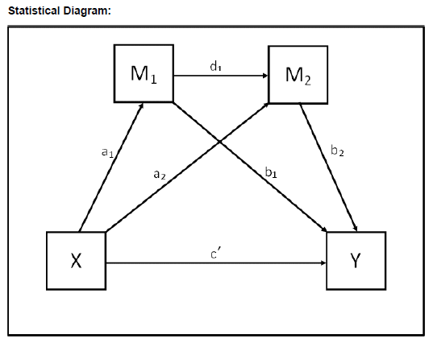

```
USEVARIABLES = X M1 M2 Y;

ANALYSIS:
  TYPE = GENERAL;
  ESTIMATOR = ML;
  BOOTSTRAP = 10000;

! In model statement name each path usingparentheses
MODEL:
  Y ON X (cdash); ! direct effect of X on Y
  Y ON M1 (b1);
  Y ON M2 (b2);
  M1 ON X (a1);
  M2 ON X (a2);
  M2 ON M1 (d1);
! Use model constraint to calculate specific indirectpaths and total indirect effect
  MODEL CONSTRAINT:
  NEW(a1b1 a2b2 a1d1b2 TOTALIND TOTAL);
    a1b1 = a1*b1; ! Specific indirect effect of X on Y via M1
    a2b2 = a2*b2; ! Specific indirect effect of X on Y via M2
    a1d1b2 = a1*d1*b2; ! Specific indirect effect of X on Y via M1 andM2
    TOTALIND = a1*b1 + a2*b2 + a1*d1*b2; ! Total indirect effect of X onY via M1, M2
    TOTAL = a1*b1 + a2*b2 + a1*d1*b2 + cdash; ! Total effect of X on Y

OUTPUT:
  STAND CINT(bcbootstrap);
```

### 第一阶段有调节的中介、第二阶段有调节的中介、两阶段有调节的中介 {#firstmome}

本文主要介绍了第一阶段有调节的中介效应(first-stage moderated mediation)、第二阶段有调节的中介效应(second-stage moderated mediation)和两阶段有调节的中介效应(dual-stage moderated mediation)的统计学原理，并将统计学逻辑通过Mplus软件写出Code出来。

通过一份原始数据，手把手带你写出上述的三类有调节的中介效应。原始数据和Mplus Code在文末的链接中。

1 第一阶段有调节的中介效应

1.1 原理

第一阶段有调节的中介效应是指$x$→$m$→$y$的中介效应被调节变量$w$所调节了，且调节效应发生在$x$→$m$之间。概念模型如下图所示：


首先构建方程(1)：

$$
m=a_{0}+a_{1}x+a_{2}w+a_{3}xw(1)
$$

其次构建方程(2)：

$$
y=b_{0}+b_{1}m+c^{'}x(2)
$$

将方程(1)带入(2)：

$$
y=b_{0}+b_{1}(a_{0}+a_{1}x+a_{2}w+a_{3}xw)+c^{'}x(3)
$$

整理得：

$$
y=(b_{0}+a_{0}b_{1}+a_{2}b_{1}w)+(a_{1}b_{1}+a_{3}b_{1}w+c^{'})x
$$

我们只关心一次项系数$a_{1}b_{1}+a_{3}b_{1}w+c^{'}$，其中$a_{1}b_{1}+a_{3}b_{1}w$就是第一阶段有调节的中介效应，系数$c^{'}$是$x$→$y$的直接效应。

本质上，第一阶段有调节的中介效应可以通过偏导数求得：

首先对方程(1)求偏导：

$$
\frac{\partial m}{\partial x}=a_{1}+a_{3}w
$$

对方程(2)求偏导: 

$$
\frac{\partial y}{\partial x}=b_{1}
$$

所以第一阶段有调节的中介效应为：

$$
\frac{\partial m}{\partial x} {\times} \frac{\partial y}{\partial x}=(a_{1}+a_{3}w)b_{1}
$$

1.2 实例

研究假设模型如下：


Depressed Affect在Economic Stress和Withdrawal
Intentions中起中介作用，Entrepreneurial self-efficacy扮演了第一阶段的有中介的调节作用。

`关于本文所用原始数据来源说明`：

estress.sav和estress.csv，Mplus以estress.csv进行分析。原始数据来源于：

Pollack, J. M., Vanepps, E. M., & Hayes, A. F. The moderating role of social ties on entrepreneurs’ depressed affect and withdrawal intentions in response to economic stress[J]. Journal of Organziational Behavior, 2012, 33: 789-810.

因为作者提供的原始数据与文章有出入，所以我根据本推文所要解决的问题分别构建了三个研究假设模型。可能结果不会显著，但我只是利用数据来练习本文所要阐述的研究方法。

原始数据的变量如下：

| 变量类型| 描述| 
|:------|:-----------|
| 控制变量| tenure sex age |
| 自变量  | estress(Economic Stress,其中心化变量为estress_mc) |
| 调节变量| ese(Entrepreneurial self-efficacy,其中心化变量为ese_mc) |
| 中介变量| affect(Depressed Affect,其中心化变量为affect_mc) |
| 因变量  | withdraw(Withdrawal Intentions) |

其他两个所构建的假设模型使用的数据也是这一数据。

关于原始数据中的`控制变量`：

控制变量的作用在于控制一些潜在的因素对你所要探究的变量所造成的影响。其实，控制变量既可以对中介变量进行回归(即认为控制变量会对中介变量产生影响)，也可以对因变量进行回归(即认为控制变量会对因变量产生影响)。到底对中介变量还是因变量回归，是根据理论和你的argument所决定的。

在接下来的分析中，我将原始数据中的控制变量认为会对中介变量造成影响。

Mplus软件对应第一阶段有调节的中介效应语法如下：

```
TITLE: first-stage moderated mediation;

DATA: FILE = estress.csv;

VARIABLE:
NAMES = tenure estress affect withdraw sex age ese estress_mc affect_mc ese_mc;

USEVAR = tenure sex age estress_mc affect_mc withdraw ese_mc interaction; !放入新生成变量

DEFINE:     !定义交互项
interaction = estress_mc*ese_mc; 

ANALYS:
TYPE = GENERAL;
ESTIMATOR = ML;
BOOTSTRAP = 1000;

MODEL:
affect_mc ON tenure
             sex
             age
             estress_mc(a1)
             ese_mc(a2)
             interaction(a3);

withdraw ON affect_mc(b1);
            estress_mc;

withdraw ON affect_mc(b1);
            estress_mc;

MODEL CONSTRAINT:
NEW(LOW HIGH DIFF);
LOW = (a1 + a3*(-0.94464))*b1;     !调节变量为低时
HIGH = (a1 + a3*0.94464)*b1;       !调节变量为高时
DIFF = HIGH - LOW;

OUTPUT:
SAMPSTAT STDYX CINTERVAL(BCBOOTSTRAP);
```

输出结果如下：


我们主要关心画红线处新生成的三个参数的显著性，可以看出在ese_mc为低时，estress_mc→affect_mc→withdraw的中介效应显著(Index=0.218, p<0.001)；在ese_mc为高时，estress_mc→affect_mc→withdraw的中介效应不显著(Index=0.051, p>0.1)；ese_mc为高和为低时，中介效应的差异显著(Index=-0.167, p<0.1)。

一般情况下，我们比较关心上述结果的95%置信区间，在下图中体现：


然后，我们可以将需要的结果复制到EXCEL中进行整理，然后再粘贴到Word中，形成期刊所需要的格式。

2 第一阶段有调节的中介效应

2.1 原理

第二阶段有调节的中介效应是指$x$→$m$→$y$的中介效应被调节变量$w$所调节了，且调节效应发生在$m$→$y$之间。概念模型如下图所示：


首先构建方程(1)：

$$
m=a_{0}+a_{1}x(1)
$$

其次构建方程(2)：

$$
y=b_{0}+b_{1}m+b_{2}w+b_{3}mw+c^{'}x(2)
$$

将方程(1)带入(2)：

$$
y=b_{0}+b_{1}(a_{0}+a_{1}x)+b_{2}w+b_{3}(a_{0}+a_{1}x)w+c^{'}x(3)
$$

整理得：

$$
y=(b_{0}+a_{0}b_{1}+b_{2}w+a_{0}b_{3}w)+(a_{1}b_{1}+a_{1}b_{3}w+c^{'})x
$$

我们只关心一次项系数$a_{1}b_{1}+a_{1}b_{3}w+c^{'}$，其中$a_{1}b_{1}+a_{1}b_{3}w$=$a_{1}(b_{1}+b_{3}w)$就是第二阶段有调节的中介效应，系数$c^{'}$是$x$→$y$的直接效应。

本质上，第二阶段有调节的中介效应可以通过偏导数求得：

首先对方程(1)求偏导：

$$
\frac{\partial m}{\partial x}=a_{1}
$$

对方程(2)求偏导: 

$$
\frac{\partial y}{\partial x}=b_{1}+b_{3}w
$$

所以第二阶段有调节的中介效应为：

$$
\frac{\partial m}{\partial x} {\times} \frac{\partial y}{\partial x}=a_{1}(b_{1}+b_{3}w)
$$

2.2 实例

研究假设模型如下：

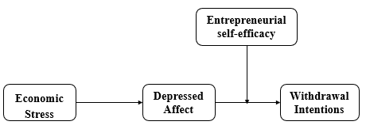

Depressed Affect在Economic Stress和Withdrawal Intentions中起中介作用，Entrepreneurial self-efficacy扮演了第二阶段的有中介的调节作用。

Mplus软件对应第二阶段有调节的中介效应语法如下：

```
TITLE: second-stage moderated mediation;

DATA: FILE = estress.csv;

VARIABLE:
NAMES = tenure estress affect withdraw sex age ese estress_mc affect_mc ese_mc;

USEVAR = tenure sex age estress_mc affect_mc withdraw ese_mc interaction; !定义新生成变量

DEFINE:      !定义交互项
interaction = affect_mc*ese_mc;

ANALYS:
TYPE = GENERAL;
ESTIMATOR = ML;
BOOTSTRAP = 1000;

MODEL:
affect_mc ON tenure
             sex
             age
             estress_mc(a1);

withdraw ON affect_mc(b1)
            ese_mc(b2)
            interaction(b3)
            estress_mc;

MODEL CONSTRAINT:
NEW(LOW HIGH DIFF);
LOW = a1*(b1 + b3*(-0.94464));       !当调节变量为低时
HIGH = a1*(b1 + b3*(0.94464));       !当调节变量为高时
DIFF = HIGH - LOW;

OUTPUT:
SAMPSTAT STDYX CINTERVAL(BCBOOTSTRAP);
```

输出结果如下：


由上面的两张图片的结果可以看出，在ese_mc为低时，estress_mc→affect_mc→withdraw的中介效应显著(Index=0.110, p<0.01)，95%CI=[0.048, 0.183]；在ese_mc为高时，estress_mc→affect_mc→withdraw的中介效应显著(Index=0.152, p<0.001), 95%CI=[0.089, 0.243]；ese_mc为高和为低时，中介效应的差异不显著(Index=0.042, p>0.1), 95%CI=[-0.018, 0.116]。

3 第一阶段有调节的中介效应

3.1 原理

第二阶段有调节的中介效应是指$x$→$m$→$y$的中介效应被调节变量$w$所调节了，且调节效应发生在$x$→$m$和$m$→$y$之间。概念模型如下图所示：

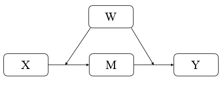

首先构建方程(1)：

$$
m=a_{0}+a_{1}x+a_{2}w+a_{3}xw(1)
$$

其次构建方程(2)：

$$
y=b_{0}+b_{1}m+b_{2}w+b_{3}mw+c^{'}x(2)
$$

将方程(1)带入(2)：

$$
y=b_{0}+b_{1}(a_{0}+a_{1}x+a_{2}w+a_{3}xw)+b_{2}w+b_{3}(a_{0}+a_{1}x+a_{2}w+a_{3}xw)w+c^{'}x(3)
$$

整理得：

$$
y=(b_{0}+a_{0}b_{1}+a_{2}b_{1}w+b_{2}w+a_{0}b_{3}w+a_{2}b_{3}w^{2})+(a_{1}b_{1}+a_{3}b_{1}w+a_{1}b_{3}w+a_{3}b_{3}w^{2}+c^{'})x
$$

我们只关心一次项系数$a_{1}b_{1}+a_{3}b_{1}w+a_{1}b_{3}w+a_{3}b_{3}w^{2}+c^{'}$，其中，$a_{1}b_{1}+a_{3}b_{1}w+a_{1}b_{3}w+a_{3}b_{3}w^{2}$=$(a_{1}+a_{3}w)(b_{1}+b_{3}w)$是两阶段有调节的中介效应，系数$c^{'}$是$x$→$y$的直接效应。

本质上，两阶段有调节的中介效应可以通过偏导数求得：

首先对方程(1)求偏导：

$$
\frac{\partial m}{\partial x}=a_{1}+a_{3}w
$$

对方程(2)求偏导: 

$$
\frac{\partial y}{\partial x}=b_{1}+b_{3}w
$$

所以两阶段有调节的中介效应为：

$$
\frac{\partial m}{\partial x} {\times} \frac{\partial y}{\partial x}=(a_{1}+a_{3}w)(b_{1}+b_{3}w)
$$

3.2 实例

研究假设模型如下：


Depressed Affect在Economic Stress和Withdrawal Intentions中起中介作用，Entrepreneurial self-efficacy扮演了两阶段的有中介的调节作用。

Mplus软件对应两阶段有调节的中介效应语法如下：

```
TITLE: dual-stage moderated mediation;

DATA: FILE = estress.csv;

VARIABLE:
NAMES = tenure estress affect withdraw sex age ese estress_mc affect_mc ese_mc;

USEVAR = tenure sex age estress_mc affect_mc withdraw ese_mc int1 int2; !放入新生成变量

DEFINE:       !定义交互项
int1 = estress_mc*ese_mc;
int2 = affect_mc*ese_mc;

ANALYS:
TYPE = GENERAL;
ESTIMATOR = ML;
BOOTSTRAP = 1000;

MODEL:
affect_mc ON tenure
             sex
             age
             estress_mc(a1)
             ese_mc(a2)
             int1(a3);

withdraw ON affect_mc(b1)
            ese_mc(b2)
            int2(b3)
            estress_mc;

MODEL CONSTRAINT:
NEW(LOW HIGH DIFF);
LOW = (a1+a3*(-0.94464))*(b1+b3*(-0.94464));     !调节变量为低时
HIGH = (a1 + a3*0.94464) * (b1 + b3*0.94464);    !调节变量为高时
DIFF = HIGH - LOW;

OUTPUT:
SAMPSTAT STDYX CINTERVAL(BCBOOTSTRAP);
```

结果输出如下：

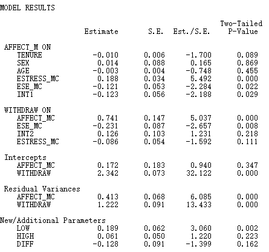


由上面的两张图片的结果可以看出，在ese_mc为低时，estress_mc→affect_mc→withdraw的中介效应显著(Index=0.189, p<0.01)，95%CI=[0.084, 0.330]；在ese_mc为高时，estress_mc→affect_mc→withdraw的中介效应不显著(Index=0.061, p>0.1), 95%CI=[-0.045, 0.163]；ese_mc为高和为低时，中介效应的差异不显著(Index=-0.128, p>0.1), 95%CI=[-0.342, 0.020]。

本小节涉及的数据和语法存放在[此处](https://pan.baidu.com/s/18CvdyI59eLxmkC-_8bDrcA)，提取码：t3jc

### 单层次有中介的调节效应 {#memo}

本小节的Mplus语法参考于[@liudong2012:StochProc]。

1 Tpye I Mediated Moderation

1.1 统计方程式

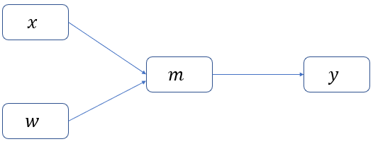

$$
m=a_{0}+a_{1}x+a_{2}w+a_{3}xw(1)
$$

$$
y=b_{0}+b_{1}x+b_{2}m+b_{3}w+b_{4}xw(2)
$$

将(1)带入(2)，整理得：

$$
y=(b_{0}+a_{0}b_{2})+(b_{1}+a_{1}b_{2})x+(a_{2}b_{2}+b_{3})w+(b_{4}+a_{3}b_{2})xw(3)
$$

其中，$b_{4}$为调节效应，$a_{3}b_{2}$为有中介的调节效应。

1.2 在Mplus中的实现

```
TITLE:
Tpye I Mediated Moderation;

DEFINE:
xw=(x-3)*(w-4); !x和w的中心化后的相互项 
centering x(grandmean); 
centering m(grandmean); 
centering w(grandmean); 

DATA:
file = example.csv;

VARIABLE:
names = x m w y;
usevar = x m w y xw;

ANALUSIS：
bootstrap = 10000;

MODEL:
m on x w
     xw(a);
y on m(b)
     x w xw;

MODEL CONSTRAINT:
new(ind);
ind = a*b;

OUTPUTE:
sampstat;
cinterval(bcbootstrap);
```
2 Tpye II Mediated Moderation

2.1 统计方程式


```
TITLE:
Tpye II Mediated Moderation;

DEFINE:
xw=(x-3)*(w-4); !x和w的中心化后的相互项 
xm=(x-3)*(m-2.5); !x和m的中心化后的相互项 
centering x(grandmean); 
centering m(grandmean); 
centering w(grandmean); 

DATA:
file = example.csv;

VARIABLE:
names = x m w y;
usevar = x m w y xw xm;

ANALUSIS：
bootstrap = 10000;

MODEL:
m on w(a)
     x;
y on xm(b)
     m x w xw;

MODEL CONSTRAINT:
new(ind);
ind = a*b;

OUTPUTE:
sampstat;
cinterval(bcbootstrap);
```

## 非线性关系 {#nonlinear}

### 有调节的倒U型效应

有调节的倒U型概念模型如下所示：


1. 构建方程(1)：

$$
y=b_{0}+b_{1}x+b_{2}x^{2}(1)
$$

2. 加入调节变量$w$后，构建方程(2):

$$
y=b_{0}+b_{1}x+b_{2}x^{2}+b_{3}w+b_{4}xw+b_{5}x^{2}w(2)
$$

如果系数$b_{5}$为负且显著，那么倒U型调节效应成立。 

整理(2)式，得:

$$
y=(b_{0}+b_{3}w)+(b_{1}+b_{4}w)x+(b_{2}+b_{5}w)x^{2}(3)
$$

如果需要画出抛物线的调节效应图，只需要在(3)式中，将$w$取两个不同的数值(一般为均值加减一个标准差)，分别构建两个方程，就可以在Excel中绘制出来了。这与线性的调节效应图的绘制逻辑类似。

此外，我们通常需要计算inflection point=$-\frac{b_{1}+b_{4}w}{2(b_{2}+b_{5}w)}$和conditional simple slope(即下面的$\theta$)的显著性。

$$
\theta=\frac{\partial y}{\partial x}=b_{1}+b_{4}w+2(b_{2}+b_{5}w)x
$$

$\theta$是$y$关于$x$的偏导数，即$x$改变1个单位时，  $y$改变了多少。

当$w$取高和低不同的值时候，the shift of the inflection point = $(-\frac{b_{1}+b_{4}w_{高}}{2(b_{2}+b_{5}w_{高})})$ - $(-\frac{b_{1}+b_{4}w_{低}}{2(b_{2}+b_{5}w_{低})})$

本小节内容参考了[@Lin2017:RNG]和[@Hu2019:RNG]相关内容。


### 有调节的倒U型中介效应

有调节的倒U型中介效应

1. U型关系

$$
y=b_{0}+b_{1}x+b_{2}x^{2}(1)
$$

方程(1)的系数$b_{2}$显著，$y$对$x$的非线性关系成立。在显著的情形下，如果$b_{2}$为负，那么为倒U型关系；如果$b_{2}$为正，即为U型关系。下面所谈及的倒U型效应的图大致是这样的：


知道了这的确是一条抛物线关系后，我们还想进一步地知道：

inflection point=$-\frac{b_{1}}{2b_{2}}$的显著性,这将会告诉我们: 当$x$小于$-\frac{b_{1}}{2b_{2}}$时,$y$是上升的趋势；当$x$大于 $-\frac{b_{1}}{2b_{2}}$时,$y$是下降的趋势。通过inflection point，我们可以大致了解抛物线的形状。

2. 第一阶段倒U型中介效应


首先构建方程：

$$
m=a_{0}+a_{1}x+a_{2}x^{2}(1)
$$

其次构建方程：

$$
y=b_{0}+b_{1}m+c^{'}_{1}x+c^{'}_{2}x^{2}(2)
$$

中介效应$\theta$为：

$$
\theta=\frac{\partial{m}}{\partial{x}}{\times}\frac{\partial{y}}{\partial{m}}=(a_{1}+2a_{2}x)b_{1}(3)
$$

根据(3)式，中介效应的大小还要取决于$m$。$m$分别取低和高不同的值，就可以得到不同的$\theta$。如果它们间存在显著差异，中介效应就可以得到验证。

3. 第二阶段倒U型中介效应


首先构建方程：

$$
m=a_{0}+a_{1}x(1)
$$

其次构建方程：
 
$$
y=b_{0}+b_{1}m+b_{2}m^{2}+c^{'}x(2)
$$

中介效应$\theta$为：

$$
\theta=\frac{\partial{m}}{\partial{x}}{\times}\frac{\partial{y}}{\partial{m}}=a_{1}(b_{1}+2b_{2}m)(3)
$$

根据(3)式，中介效应的大小还要取决于$m$。$m$分别取低和高不同的值，就可以得到不同的$\theta$。如果它们间存在显著差异，中介效应就可以得到验证。

4. 第一阶段有调节的倒U型中介效应

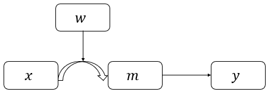

构建方程(1)：

$$
m=a_{0}+a_{1}x+a_{2}x^{2}(1)
$$

加入调节变量$w$后，构建方程(2):
 
$$
m=a_{0}+a_{1}x+a_{2}x^{2}+a_{3}w+a_{4}xw+a_{5}x^{2}w(2)
$$

构建方程(3):

$$
y=b_{0}+b_{1}m+c^{'}_{1}x+c^{'}_{2}x^{2}(3)
$$

由方程(2)和方程(3)可知:

$$
\frac{\partial m}{\partial x}{\times}\frac{\partial y}{\partial m}=(a_{1}+a_{4}w+2(a_{2}+a_{5}w)x)b_{1}
$$

所以第一阶段有调节的倒U型中介效应为:

$$
\theta=(a_{1}+a_{4}w+2(a_{2}+a_{5}w)x)b_{1}
$$

可以看出，第一阶段有调节的倒U型中介效应大小不仅取决于调节变量$w$，也取决于自变量$x$。如下表所示，我们需要分别取$w$和$x$的低和高的值，来判断第一阶段有调节的倒U型中介效应是否显著。

|    $w$|    $x$|$\theta$| 置信区间|  
|:------|:------|:------|:------|
|     低|     低| $\theta_{x低w低}$ | $\theta_{x低w低}$对应的置信区间|
|     低|     高| $\theta_{x低w高}$ | $\theta_{x低w高}$对应的置信区间|
|     高|     低| $\theta_{x高w低}$ | $\theta_{x高w低}$对应的置信区间|
|     高|     高| $\theta_{x高w高}$ | $\theta_{x高w高}$对应的置信区间|

显著的标准是：
 
* $\theta_{1}=\theta_{x低w高}-\theta_{x低w低}$显著；

* $\theta_{2}=\theta_{x高w高}-\theta_{x高w低}$显著；

* $\theta_{1}$与$\theta_{2}$的差异显著。


5. 第二阶段有调节的倒U型中介效应

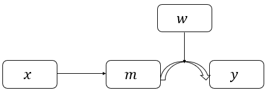

构建方程(1)：

$$
m=a_{0}+a_{1}x(1)
$$

加入调节变量$w$后，构建方程(2):
 
$$
y=b_{0}+b_{1}m+b_{2}m^{2}+c^{'}x(2)
$$

构建方程(3):

$$
y=b_{0}+b_{1}m+b_{2}m^{2}+b_{3}w+b_{4}mw+b_{5}m^{2}w+c^{'}x(3)
$$

由方程(1)和方程(3)可知:

$$
\frac{\partial m}{\partial x}{\times}\frac{\partial y}{\partial m}=a_{1}(b_{1}+b_{4}w+2(b_{2}+b_{5}w)m)
$$

所以第一阶段有调节的倒U型中介效应为:

$$
\theta=a_{1}(b_{1}+b_{4}w+2(b_{2}+b_{5}w)m)
$$

可以看出，第一阶段有调节的倒U型中介效应大小不仅取决于调节变量$w$，也取决于自变量$m$。如下表所示，我们需要分别取$w$和$m$的低和高的值，来判断第一阶段有调节的倒U型中介效应是否显著。

|    $m$|    $w$|$\theta$| 置信区间|  
|:------|:------|:------|:------|
|     低|     低| $\theta_{x低w低}$ | $\theta_{x低w低}$对应的置信区间|
|     低|     高| $\theta_{x低w高}$ | $\theta_{x低w高}$对应的置信区间|
|     高|     低| $\theta_{x高w低}$ | $\theta_{x高w低}$对应的置信区间|
|     高|     高| $\theta_{x高w高}$ | $\theta_{x高w高}$对应的置信区间|

显著的标准是：
 
* $\theta_{1}=\theta_{x低w高}-\theta_{x低w低}$显著；

* $\theta_{2}=\theta_{x高w高}-\theta_{x高w低}$显著；

* $\theta_{1}$与$\theta_{2}$的差异显著。

本小节内容参考了[@Lin2017:RNG]和[@Hu2019:RNG]相关内容。


## 绘制调节效应图 {#modplot}

### SPSS+Mplus+Excel计算简单斜率并绘制调节效应图

本小节采用的数据来源于发表在Journal of Applied Psychology的文章[@Liu2020:RNG]。

本文主要follow原文的study 1。原文提供的数据是Stata格式，已转换成了SPSS格式数据。数据中变量的相关信息如下：

| 变量类型| 详细信息| 
|:------|:-----------|
| 控制变量| EMP_GENDER; EMP_AGE; EMP_EDU; EMP_TenSup |
| 自变量(的条目)| EMP_MC_mean (EMP_MC1; EMP_MC2; EMP_MC3) |
| 因变量(的条目)| SUP_ECREA_mean (SUP_ECREA1; SUP_ECREA2; SUP_ECREA3; SUP_ECREA4; SUP_ECREA5; SUP_ECREA6; SUP_ECREA7; SUP_ECREA8; SUP_ECREA9; SUP_ECREA10; SUP_ECREA11; SUP_ECREA12; SUP_ECREA13) |
| 调节变量(的条目)| EMP_SUPEL_mean (EMP_SUPEL1; EMP_SUPEL2; EMP_SUPEL3; EMP_SUPEL4; EMP_SUPEL5; EMP_SUPEL6; EMP_SUPEL7; EMP_SUPEL8; EMP_SUPEL9; EMP_SUPEL10) |

1. 利用SPSS的Syntax进行相关分析


如上表所示，相关分析表格中需要$\alpha$系数、均值、标准差和变量之间的相关系数。

在SPSS的语法中，计算变量的$\alpha$值语法为：

```
*计算MC的alpha信度.
RELIABILITY
  /VARIABLES=EMP_MC1 EMP_MC2 EMP_MC3
  /SCALE('ALL VARIABLES') ALL
  /MODEL=ALPHA.

*计算EL的alpha信度.
RELIABILITY
  /VARIABLES=EMP_SUPEL1 EMP_SUPEL2 EMP_SUPEL3 EMP_SUPEL4 EMP_SUPEL5 EMP_SUPEL6 EMP_SUPEL7 
    EMP_SUPEL8 EMP_SUPEL9 EMP_SUPEL10
  /SCALE('ALL VARIABLES') ALL
  /MODEL=ALPHA.

*计算CREA的alpha信度.
RELIABILITY
  /VARIABLES=SUP_ECREA1 SUP_ECREA2 SUP_ECREA3 SUP_ECREA4 SUP_ECREA5 SUP_ECREA6 SUP_ECREA7 
    SUP_ECREA8 SUP_ECREA9 SUP_ECREA10 SUP_ECREA11 SUP_ECREA12 SUP_ECREA13
  /SCALE('ALL VARIABLES') ALL
  /MODEL=ALPHA.
```

输出结果为：


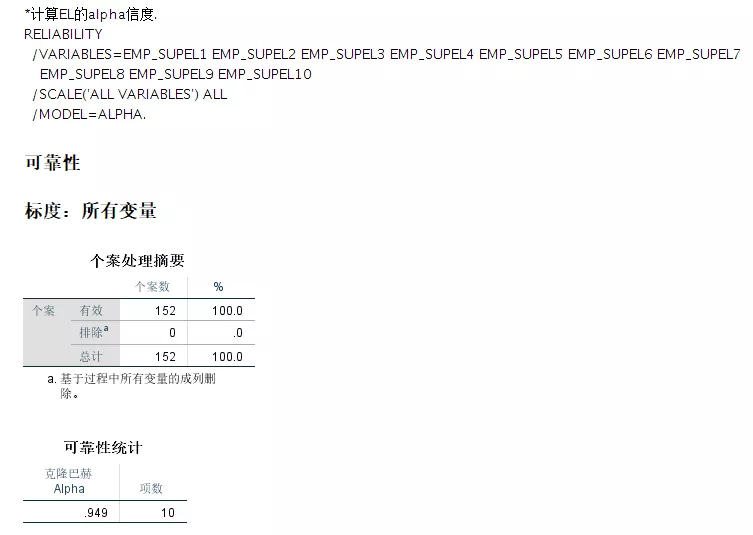

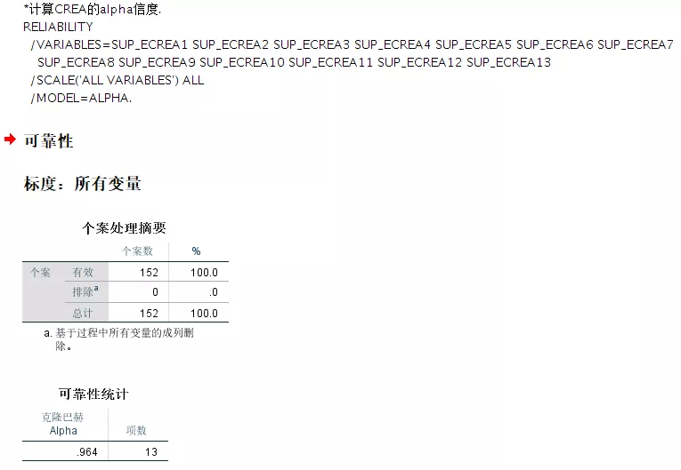

变量的均值、标准差语法为：

```
*计算变量的均值和标准差.
DESCRIPTIVES VARIABLES=EMP_GENDER EMP_AGE EMP_EDU EMP_TenSup EMP_MC_mean EMP_SUPEL_mean 
    SUP_ECREA_mean
  /STATISTICS=MEAN STDDEV.
```

输出结果为：


变量之间的相关系数语法为：

```
*计算变量间的相关系数.
CORRELATIONS
  /VARIABLES=EMP_GENDER EMP_AGE EMP_EDU EMP_TenSup EMP_MC_mean EMP_SUPEL_mean SUP_ECREA_mean
  /PRINT=TWOTAIL NOSIG
  /MISSING=PAIRWISE.
```

输出结果为：


把上述结果复制到Excel中加以整理，然后再复制到WORD中，就可以得到类似原文的相关系数表了。在Excel中，我初步整理的结果如下：

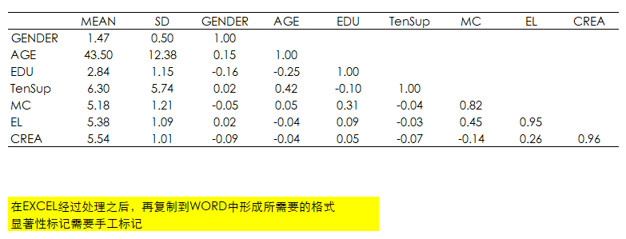

2. 利用SPSS的Syntax进行层级回归分析

在进行层级回归分析前，首先对自变量和调节变量进行中心化。中心化可以有效减少自变量和调节变量的交互项与它们(自变量和调节变量)的共线性。关于中心化，一般是均值中心化，并且只有自变量和调节变量需要中心化，因变量是不需要中心化的(但中心化也没什么太大的问题，只不过没有必要这么做)。

SPSS的中心化语法为：

```
*计算变量MC和EL的均值.
AGGREGATE
  /OUTFILE=* MODE=ADDVARIABLES
  /BREAK=
  /MC_mean=MEAN(EMP_MC_mean) 
  /EL_mean=MEAN(EMP_SUPEL_mean).

*变量MC和EL进行均值中心化.
COMPUTE MC_mc=EMP_MC_mean-MC_mean.
COMPUTE EL_mc=EMP_SUPEL_mean-EL_mean.
EXECUTE.
```

接下来计算交互项：

```
*计算交互项.
COMPUTE INTERACTION=MC_mc*EL_mc.
EXECUTE.
```

然后就可以进行层级回归分析了：

```
*层级回归.
REGRESSION
  /MISSING LISTWISE
  /STATISTICS COEFF OUTS R ANOVA CHANGE
  /CRITERIA=PIN(.05) POUT(.10)
  /NOORIGIN 
  /DEPENDENT SUP_ECREA_mean
  /METHOD=ENTER EMP_GENDER EMP_AGE EMP_EDU EMP_TenSup
  /METHOD=ENTER EMP_GENDER EMP_AGE EMP_EDU EMP_TenSup MC_mc
  /METHOD=ENTER EMP_GENDER EMP_AGE EMP_EDU EMP_TenSup MC_mc EL_mc INTERACTION.
```

结果如下：


上述这张表主要是输出回归系数(原文的Model 2的截距项系数是6.27,这是变量未中心化的回归分析结果，但Model 3原文又采用了中心化后的回归分析结果。此处存疑)。

模型的$R^{2}$和$\triangle R^{2}$由下面这张表输出来：


把上述结果复制到Excel中加以整理，然后再复制到WORD中，就可以得到类似原文的层级回归分析表了。EXCEL中的初步整理如下：


3. 利用Mplus的Syntax进行简单斜率检验

3.1 原理

一般的线性回归方程为($w$为调节变量)： 

$$
y=b_{0}+b_{1}x+b_{2}w+b_{3}x{\times}w
$$

整理后可得：  

$$
y=(b_{0}+b_{2}w)+(b_{1}+b_{3}w)x
$$

所以$x$对$y$的影响在于系数$b_{1}+b_{3}w$是否显著，而这个系数并不是固定的，取决于$w$的大小。我们通常取$w$的均值加一个标准差和均值减一个标准差。即当$w_{high}=M_{w}+SD_{w}$和$w_{low}=M_{w}-SD_{w}$时，我们可以得到两个方程(两条直线)，只需要检验这两条直线斜率以及斜率的差异是否显著，就可以判断$w$在不同情形下$x$对$y$的影响是否显著。

其他软件进行简单斜率检验非常困难，但在Mplus中，很容易实现，且语法的书写逻辑非常流畅。

3.2 语法

首先将SPSS格式数据转换成.csv格式数据。Mplus的语法如下：

```
DATA: FILE = data.csv;

VARIABLE:
MISSING = ALL(-999);   !定义数据中的-999为缺失值,本数据中没有缺失值,但建议写

NAMES = SUP_ECREA1 SUP_ECREA2 SUP_ECREA3 SUP_ECREA4 SUP_ECREA5 SUP_ECREA6 SUP_ECREA7
SUP_ECREA8 SUP_ECREA9 SUP_ECREA10 SUP_ECREA11 SUP_ECREA12 SUP_ECREA13 EMP_MC1  
EMP_MC2  EMP_MC3  EMP_SUPEL1 EMP_SUPEL2 EMP_SUPEL3 EMP_SUPEL4  EMP_SUPEL5  
EMP_SUPEL6 EMP_SUPEL7 EMP_SUPEL8 EMP_SUPEL9  EMP_SUPEL10 EMP_AGE EMP_GENDER  
EMP_EDU  EMP_TenSup EMP_MC_mean EMP_SUPEL_mean SUP_ECREA_mean 
MC_mean  EL_mean  MC_mc EL_mc INTERACTION;

USEVAR = EMP_AGE EMP_GENDER  EMP_EDU  EMP_TenSup 
MC_mc EL_mc SUP_ECREA_mean INTERACTION;

ANALYSIS:
TYPE = GENERAL;
ESTIMATOR = ML;
BOOTSTRAP = 1000;     !bootstrap次数为1000

MODEL:
[SUP_ECREA_mean](b0);            !估计SUP_ECREA_mean的截距,系数为b0
SUP_ECREA_mean ON EMP_GENDER
                  EMP_AGE   
                  EMP_EDU  
                  EMP_TenSup 
                  MC_mc(b1)
                  EL_mc(b2)
                  INTERACTION(b3);

MODEL CONSTRAINT:
NEW(HIGH_SLOP LOW_SLOP DIFF H_INTERCEPT L_INTERCEPT);
HIGH_SLOP = b1 + b3*1.08996;        !调节变量取其均值加一个标准差(即1.08996)
LOW_SLOP = b1 + b3*(-1.08996);      !调节变量取其均值加一个标准差(即-1.08996)
DIFF = HIGH_SLOP - LOW_SLOP;        !可以理解为简单斜率检验

H_INTERCEPT = b0 + b2*1.08996;     !调节变量为HIGH时的截距
L_INTERCEPT = b0 + b2*(-1.08996);  !调节变量为LOW时的截距

OUTPUT:
!输出变量基本统计量,标准化系数,Boostrap置信区间,缺失值描述
SAMPSTAT STDYX CINTERVAL(BCBOOTSTRAP) PATTERNS;
```

解释下为什么需要计算两条直线的截距[H_INTERCEPT = b0 + b2 $\times$ 1.08996; L_INTERCEPT = b0 + b2 $\times$ (-1.08996)]。实际上我们根本不关心截距的显著性，但为了后续能够直观地写出方程(如果不让软件帮你计算截距项，你就得自己手工计算)，还是在语法中添加了计算截距项的语法。

至于调节变量的均值和标准差，可以在SPSS中完成，其语法为：

```
*计算中心化后的调节变量的均值和标准差.
DESCRIPTIVES VARIABLES=EL_mc
  /STATISTICS=MEAN STDDEV.
```

Mplus的输出结果如下：


以上结果表明，当EL高时，斜率*B* = -0.149, *p* > 0.1，即不显著；当EL低时，斜率*B* = -0.457, *p* < 0.001。这与原文报告的结果一致。

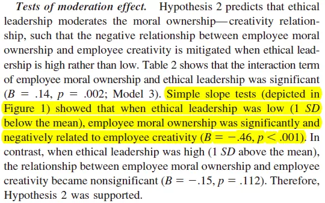

我们还可以查看两条直线斜率的偏差校正的置信区间：


4. 利用Excel绘制调节效应图

至少50%的人只使用了Excel的50%的功能。Excel对数据结果的整理非常友善，我们以Mplus输出的两条直线在Excel中绘制调节效应图。逻辑很简单，我们已经有了当调节变量(EL)为高和低时的两条直线，接下来我们只需要在Excel中画出这两条直线就可以了。


根据上述Mplus的输出结果，我们可以知道：


当EL=1.08996(调节变量为高情形,因为EL进行了中心化,所以均值为0)时，直线方程为：

CREAT=5.659-0.149*MC

当EL=-1.08996(调节变量为低情形)时，直线方程为：

CREAT=4.687-0.457*MC

两点确定一条直线，因为原文是李克特7点量表，所以就选取MC=1和MC=7两点，带入方程后求得对应的CREAT值。

选取好了点后，我们就可以在Excel中绘图了。效果如下：


在Excel中进行操作的静音视频如下，帮助大家理解绘制的过程：

<iframe width="560" height="315"
src="https://www.bilibili.com/video/BV1ga4y1e7wZ" frameborder="0" allow="accelerometer; autoplay; encrypted-media; gyroscope; picture-in-picture" allowfullscreen></iframe>

本小节的数据存放在[此处](https://pan.baidu.com/s/1gxaa4SfN4IKnMy3bydmuXQ)，提取码：ugmh


### 利用R作调节效应图


<!--chapter:end:1001-chapter01.Rmd-->

# 多层次线性回归模型 {#multilevel}


## 相关概念介绍 {#multiconcept}

当研究涉及到不同的层面时，我们可能就需要构建跨层模型来验证研究假设。比如当我们想要讨论员工个性(personality)和员工创造力(creativity)之间的关系时，个体层面的personality→creativity之间的关系可能会受到团队层面的团队氛围(team climate)的影响。 

较为常见的是两层线性模型。即使是三层线性模型，都不是很常见。以下以常见的两层线性模型为例。

1. 基本的两层线性模型阐述

第一层的方程：

$$
Y_{ij} = \beta_{0j} + \beta_{1j}X_{ij} + r_{ij}
$$

第二层的方程：

$$
\beta_{0j} = \gamma_{00} + \gamma_{01}W_j + u_{0j}
$$

$$
\beta_{1j} = \gamma_{10} + \gamma_{11}W_j + u_{1j}
$$

模型中的参数含义如下:

$\beta_{0j}$: 在第$j$组中，$X$对$Y$平均的影响(即截距)

$\beta_{1j}$: 在第$j$组中，当$X$改变一个单位时，$Y$的改变量

$r_{ij}$: 每一组中，$X$估计$Y$的误差(残差)

在第二层模型中，$\beta_{0j}$和$\beta_{1j}$是随着$j$的不同(组与组之间)而发生改变。$\beta_{0j}$和$\beta_{1j}$是随机的，而不是固定不变的(即第二层模型是`随机效应模型`)，改变的程度可用$W$来估计。而第一层的$\beta_{0j}$和$\beta_{1j}$是固定不变的，所以第一层模型被成为`固定效应模型`。

$\gamma_{00}$: $W_j$对$\beta_{0j}$(组内$X$对$Y$平均的影响)的平均影响

$\gamma_{01}$: 当$W_j$改变一个单位时，$\beta_{0j}$的改变量

$u_{0j}$: $W_j$估计$\beta_{0j}$的误差

$\gamma_{10}$: $W_j$对$\beta_{1j}$(组内$X$对$Y$的影响)的平均影响

$\gamma_{11}$: 当$W_j$改变一个单位时，$\beta_{1j}$的改变量

$u_{1j}$: $W_j$估计$\beta_{1j}$的误差


一般的线性回归方程($Y=\beta_0+\beta_1X$)中，我们一般只关注一次项系数($\beta_1$)的显著性，因为截距项($\beta_0$)一般来说没有意义。但当$X$中心化(例如均值中心化：$X-\bar{X}$)后，$\beta_0$意味着$X$对$Y$的平均影响。这也就解释了为什么$\beta_{0j}$是在第$j$组中，$X$对$Y$平均的影响，实际上我们是默认为方程进行了中心化。

随之而来的一个问题是：跨层回归方程中如何进行中心化(centering)？中心化主要有两个目的：一是避免产生不合理的解释；二是避免共线性问题。在多层回归分析中，主要有总平均值中心化(Grand Mean Centering,$x-\bar{x}_{ij}$,$\bar{x}_{ij}$是所有数据的平均数 )和分组平均值中心化(Group Mean Centering,$\bar{x}_{.j}$是第$j$组的$x_{ij}$值的平均数)。

简言之，在第一层的方程中，我们希望进行组内中心化，主要有以下几个好处：一是小组之间截距($\beta_{0j}$)的方差=小组平均数($\bar{y}_{.j}$)的方差，这就方便了第二层中$\gamma_{00}$的理解($\gamma_{00}$就是第二层变量$W_j$对每一组的$\bar{y}_{.j}$的影响)；二是区别开了组内效应和组间效应，组内效应是在第一层估计，组间效应就留给第二层估计。第一层采用分组平均值中心化后，第二组其实也就不太需要进行中心化了。所以，我们一般会把基本的$HLM$表述为：

$$
\left\{ \begin{aligned} 
        Y_{ij} = \beta_{0j} + \beta_{1j}(X_{ij} - \bar{X}_{.j}) + r_{ij} \\
        \beta_{0j} = \gamma_{00} + \gamma_{01}W_j + u_{0j} \\
         \beta_{ij} = \gamma_{10} + \gamma_{11}W_j + u_{1j}   
\end{aligned} \right.
$$

论文中也有采用第一层和第二层都是总平均值中心化的，第一层分组平均值中心化第二层总平均值中心化的。其实从统计上来说，都没有太大问题。实际上我们一般只关注回归系数的显著性。


2. 统计检验

* 验证$u_{0j}$=0.讨论$W_j$是否有足够能力去解释$\beta_{0j}$(组间的截距)的差异。当$u_{0j}$=0时，表示$W_j$可以解释组间的截距的所有差异。$u_{0j}$服从$\chi$分布。  

* $W_j$与$\beta_{0j}$的关系。通过验证回归系数的$t$检验来验证系数$\gamma_{00}$和$\gamma_{01}$是否显著。

* 类似地，可以通过验证$u_{1j}$=0.讨论$W_j$是否有足够能力去解释$\beta_{1j}$(组间的斜率)的差异，$u_{1j}$也服从$\chi$分布。同样也可以通过$t$检验来验证系数$\gamma_{10}$和$\gamma_{11}$的显著性($W_j$与$\beta_{1j}$的关系)。

3. 四种变化模型

完整的两层线性模型：

$$
\left\{ \begin{aligned} 
        Y_{ij} = \beta_{0j} + \beta_{1j}X_{ij} + r_{ij} \\
        \beta_{0j} = \gamma_{00} + \gamma_{01}W_j + u_{0j} \\
         \beta_{ij} = \gamma_{10} + \gamma_{11}W_j + u_{1j}   
\end{aligned} \right.
$$

3.1 变化之一：Model 1

$$
\left\{ \begin{aligned} 
        Y_{ij} = \beta_{0j} + r_{ij} \\
        \beta_{0j} = \gamma_{00} + u_{0j}       
\end{aligned} \right.
$$

$Y_{ij}$受三个因素影响： 

一个总平均($\gamma_{00}$);

一个随机的第二层效应($u_{0j}$);

一个随机的第一层效应($r_{ij}$)。

这实质上是方差分析($ANOVA$)。

3.2 变化之二：Model 2

$$
\left\{ \begin{aligned} 
        Y_{ij} = \beta_{0j} + \beta_{1j}X_{ij}+ r_{ij} \\
        \beta_{0j} = \gamma_{00} + u_{0j} \\
        \beta_{1j} = \gamma_{10}       
\end{aligned} \right.
$$

$Y_{ij}$受四个因素影响： 

一个总平均($\gamma_{00}$);

一个随机的第二层效应($u_{0j}$);

一个变量($X_{ij}$)的影响效应($\gamma_{10}$);

一个随机的第一层效应($r_{ij}$)。

这实质上是协方差分析($ANCOVA$)。

3.3 变化之三： Model 3

$$
\left\{ \begin{aligned} 
        Y_{ij} = \beta_{0j} + \beta_{1j}X_{ij}+ r_{ij} \\
        \beta_{0j} = \gamma_{00} \\
        \beta_{1j} = \gamma_{10}       
\end{aligned} \right.
$$

$Y_{ij}$受三个因素影响： 

一个总平均($\gamma_{00}$);

一个变量($X_{ij}$的影响效应($\gamma_{10}$);

一个随机的第一层效应($r_{ij}$)。

 Model 3中，第二层都是参数，所以其实就等同于一个单层的线性回归模型。

3.4 变化之四：Model 4

$$
\left\{ \begin{aligned} 
        Y_{ij} = \beta_{0j} + \beta_{1j}X_{ij}+ r_{ij} \\
        \beta_{0j} = \gamma_{00} + u_{0j} \\
        \beta_{1j} = \gamma_{10} + u_{1j}       
\end{aligned} \right.
$$

$Y_{ij}$受五个因素影响： 

一个总平均($\gamma_{00}$);

一个随机的第一层效应($r_{ij}$)；

一个随机的第二层效应($u_{0j}$);

一个变量($X_{ij}$)的影响效应($\gamma_{10}$);

一个随机的第二层效应($u_{1j}$)。

虽然Model 4看似是一个简单的线性回归方程，但因为分为两层，截距和回归系数可以在不同层面上发生改变。

4. $R_{wg}$和$ICC$的建议

$R_{wg}$和$ICC$都是判断能否进行分层线性回归模型分析的指标。

$R_{wg}$是组内评分者信度指标(within-group interrater reliability)，$j$一般是指构念量表的题目数量。它是判断低层面的变量是否有足够的信度上升(聚合)到高层面中去的依据。理论上来说，$R_{wg}$介于0和1之间，大于0.7较为理想。但实际操作中，也有可能出现小于0或大于1的现象。这种情况下，一般可将小于0的值视为0，大于1的值视为1[@law2014:StochProc]。

$ICC$是组内相关系数(intra-class correlation)，分为$ICC(1)$和$ICC(1)$。二者的区别简单来说是：$ICC(1)$是小组内不同成员的评分的信度；$ICC(2)$是小组的平均评分的信度。对于$ICC(2)$的理解，我们可以这样来看：当我们从$n$个组内随机从每个组内抽取$k$个成员，计算每一组的平均。理论上我们可以重复上述步骤再做一次。这样我们就会有两个样本，每个样本都有$n$个组，每个组有$k$个成员的平均分。$ICC(2)$就可以看成是这两个样本的$n$个平均的相关系数。通常来说，$ICC(1)$大于0.12、$ICC(2)$大于0.7较为合适。关于聚合建议值标准的阐述，希望可以引用相关的参考文献，这样比较有理有据。跨层分析的文献有很多，可以从中去引用。不一一赘述。


<!--chapter:end:2002-chapter02.Rmd-->

# 元分析 {#meta}


## 元分析中的常见概念及原理 {#meta-concept}

**1. 同质性检验**

同质性检验回答的是不同的研究样本是否来自于同一个总体。如果所收集的文献中的研究样本来自于同一个总体，那么在接下来的分析中应当选用固定效应模型；如果不是来自于同一个总体，后续分析中应当选用随机效应模型。

从以上的论述中可以看出：固定效应模型(Fixed Effect Model)假设元分析中所包含的研究样本都来自于同一个样本总体。因为这个总体的平均效应值是固定的，所以来自这个总体的不同研究样本所得出的效应值在理论上应该也是同质(Homogeneous)的；随机效应模型(Random Effect Model)假设元分析中的研究样本是来自于不同的总体，由于不同总体存在不同的效应值，那么不同研究样本的效应值在理论上应该是异质的(heterogeneous)。

固定效应模型认为误差主要是由于同一总体的抽样误差所造成的；而随机效应模型则认为误差不仅存在于抽样误差，同时也包括不同总体间的效应值的差异。

**1.1 总体的相关系数($\rho$)与研究样本的抽样分布方差($S_{e}^{2}$)的关系** 

$$
S_{e}^{2}={{(1-\rho^2)^2}\over{N-1}}
$$

$S_{e}^{2}$是当我们从相关系数是$\rho$的总体中抽出样本数为$N$的样本时，不同样本的相关系数($r$)的概率分布的方差。


从上式可知，总体相关系数越大($r$)，样本的相关系数离总体的相关系数的差异($S_{e}^{2}$)就越小；样本量($N$)越大，样本的相关系数离总体的相关系数的差异($S_{e}^{2}$)就越小。

正是因为上述的原因，由于不同研究的样本量存在差异，虽然可能它们是来自于同一个总体，但我们观察到它们各自的样本相关系数都会不一样。

**1.2 同质还是异质？(是否存在调节变量)**

我们可以建立如下公式：

$$
S_{\rho}^{2}=S_{r}^{2}-S_{e}^{2}
$$

即总体相关系数的方差=观察到相关系数的方差-抽样误差引起的方差。

$S_{r}^{2}$是我们从不同的样本中观察到的不同的相关系数所形成的方差，为观察方差(observed variance)。

$S_{\rho}^{2}$是假设不同的样本是从不同的总体中抽出来的，不同的总体有不同的相关系数。所以，这些不同的总体相关系数就形成了方差，称之为真实方差(true variance)，其代表了不同总体中相关系数的真实差异。

而$S_{e}^{2}$代表假的方差(artifactual variance)，是由于抽样而产生的方差。

如果$S_{\rho}^{2}\leqslant0$，就代表总体中相关系数没有方差，即样本背后只有一个总体，也就是只有一个总体相关系数。在这种情况下，不同样本相关系数的差异，就完全是抽样误差所引起的。如果$S_{\rho}^{2}>0$,大致可以判断样本背后应该有不同的总体，不同的总体有不同的相关系数。

如果抽样方差能够解释观察方差的75%(${{S_{e}^{2}}\over{S_{r}^{2}}}\geqslant$ 75%)，就可以判断样本都是从同一个总体抽出来的，没有必要寻找可能的调节变量。如果${{S_{e}^{2}}\over{S_{r}^{2}}}$ < 75%，就有必要寻找是否有调节变量的存在。

**1.2.1 $Q$统计量**

除去75%法则，$Q$统计量也可作为判断研究间是否存在异质性的依据，公式为： 

$$
Q=\sum_{i=1}^{k}(n_{i}-3)(z_{i}-z_{+})^{2}
$$

其中，$z_{i}$是不同研究样本的相关系数，是用$FisherZ$转换成的$Z$值。$Z$值的计算公式为：

$$
FisherZ={1\over2}ln{{(1+r)}\over{(1-r)}}
$$

$z_{+}$是整个元分析的加权平均相关系数，是用$FisherZ$转换成的$Z$值。

$n_{i}$是不同研究的样本量。

$Q$统计量服从$\chi^{2}$分布。我们的零假设是总体中只有一个相关系数。如果$Q$统计量不显著，就代表在总体中只有一个相关系数，没有必要进一步寻找调节变量了。

**1.2.2 $H$统计量**

进一步地,$H$检验是$Q$统计量的校正值。计算公式为： 

$$
H=\sqrt{{Q}\over{k-1}}
$$

其中，$k$是纳入研究的数量，如果${Q}\over{k-1}$<1，则视$H$=1。

$H$=1表示研究间无异质性;$H$介于1.2和1.5之间，如果$H$值的95%CI包含1，则在0.05检验水平下无法确定是否存在异质性，若不包含1则认为存在异质性;$H$>1.5则表示研究间存在异质性。

**1.2.3 $I^{2}$统计量**

$I^{2}$描述了研究间变异占总变异的百分比，计算公式为： 

$$
\left\{ \begin{aligned} 
        I^{2} = {{{Q-df}\over{Q}},Q>df} \\
        I^{2} = 0,{Q}\leqslant{df}
\end{aligned} \right.
$$

其中，$df$是$Q$统计量的自由度。当$I^{2}$=0%时，研究间无异质性；25%为轻度异质性；50%为中度异质性；75%为高度异质性。

**2. 发表偏倚检验**

**2.1 漏斗图**

漏斗图(funnel plot)，是使用效应值和样本量作为坐标系，将各个研究绘制在坐标系里的散点图。对于样本量越大的研究样本来说，其效应值估计也就越准确，误差也越小。呈现在漏斗图中，样本量大的研究样本会集中在图的上方、平均效应值的周围；而样本量小的研究样本则会散落在漏斗图的底部，距离平均效应值较远。

具体来说，如果图形呈现一个倒着的漏斗形状，则表明发表偏差不太可能存在；如果漏斗图不对称，有缺角，则表明发表偏差可能存在。

漏斗图是一种主观的定性判断有无发表偏倚的方法，不同的人对漏斗图对称性可能会做出不同的判断。客观的统计检验方法主要有Begg秩相关检验和Egger's回归系数检验。

**2.2 剪补法**

剪补法(Trim and Fill)是将不对称的漏斗图中的研究样本进行删减，使其变成对称的漏斗，并对校正后的样本重新估计。基本过程主要包括：剪掉引起漏斗图中不对成的小样本研究；用修剪后的对称部分估计漏斗图的中心值；然后沿中心两侧添补被剪切的以及相应的估计缺失研究。剪补法既可以估计缺失研究的数目，也可以将缺失研究纳入重新进行Meta分析。

剪补法是基于发表偏倚会造成漏斗图不对称这一研究假设，采用迭代方法估计缺失研究的数量。其意义不是估计缺失研究的具体数目，而在于判断结果的稳健性。在添补一部分研究后，重新进行Meta分析。如果合并效应量估计值与剪补之前的变化不明显，说明发表偏倚不是很严重，结果比较稳健。

2.3 失安全系数

因为结果不显著的研究成果是很难发表的。在解释元分析的结果时, 应该充分考虑这种"发表偏倚"或"抽屉文件效应"(file-drawer effect, 指结果不显著的研究成果最终只能锁在抽屉里)。

失安全系数(fail-safe N, Nfs)，估计还需要存在多少未发表的研究才能将现有的研究结果从显著变得不显著。Nfs越大, 说明元分析的结果越稳定, 结论被推翻的可能性就越小。

**2.4 森林图和累积森林图**

森林图(forest plot)，让研究者"既见树木又见森林"。它有助于研究者正确解释分析结果，并能发现纳入研究的一些异常情况(如某个极端值)，可以视森林图为发表偏倚的初步视觉印象。

累积Meta分析是把纳入的研究作为一个连续的整体，将各个纳入的研究按一定的次序(如研究发表的时间、样本量大小、研究质量评分)，依次地加在一个研究上，进行多次Meta分析。每当有新的研究发表后，就可以进行一次Meta分析。累积Meta分析可以反映研究结果的动态变化趋势，有助于尽早发现有统计学意义的干预措施，同时也能被应用于评估发表偏倚或小样本研究对效应量估计产生的潜在影响。累积Meta分析作出来的森林图即是累积森林图。

**3. 敏感性分析**

敏感性分析(Sensitivity Analysis)，是在一定条件下检验所获结果稳健性的方法，改变某些影响合并结果的重要性(如纳入标准、研究质量的高低、不同统计方法和不同效应量等)，重新进行Meta分析之后，与改变条件之前的Meta分析进行比较，观察前后是否发生变化。如果前后结果没有本质上改变(无改变或改变不大)，说明Meta分析结果较为可信；反之，则不太可信[@zhangyi2009:RNG]。

剪补法和失安全系数法其实就是两种常见的敏感性分析方法。

**4. 主效应检验**

**4.1 如何计算效应值**

在固定效应模型中，首先通过$FisherZ$转换将每一个研究的相关系数$r$转换成$Z$值，转换后的$Z$值可以通过下面的公式计算加权平均效应值$\bar{Z_{r}}$：

$$
\bar{Z_{r}}={{\sum_{i=1}^{k}(n_{i}-3)FisherZ_{i}}\over{\sum_{i=1}^{k}(n_{i}-3)}}
$$

其中，${1}\over{n_{i}-3}$是计算的权重值，同时也是不同的研究样本内方差(Within-Study Variance)。 

而在随机效应模型中，不仅需要考虑研究样本内方差，同时也要考虑研究样本间方差(Between-Study Variance ,用$\tau^{2}$表示 )，计算公式为： 

$$
\tau^{2}={{Q-(k-1)}\over{\sum_{i=1}^{k}(n_{i}-3)-{{\sum_{i=1}^{k}(n_{i}-3)^{2}}\over{\sum_{i=1}^{k}(n_{i}-3)}}}}
$$

随机效应模型中的权重值$w_{i}$等于： 

$$
w_{i}={{1}\over{{{1}\over{n_{i}-3}}+\tau^{2}}}
$$

所以，随机效应模型的加权平均效应值$\bar{Z_{r}}$为： 

$$
\bar{Z_{r}}={{\sum_{i=1}^{k}w_{i}FisherZ_{i}}\over{\sum_{i=1}^{k}w_{i}}}
$$

**4.2 相对权重分析**

相对权重分析(relative weight analysis)能够通过数据转换、相关分析和回归分析，计算各自变量对因变量的独立作用[@xuyan2019:RNG]。

在进行元分析时，可以通过以往的元分析和实证研究结果，形成研究变量间的相关矩阵。通过相关矩阵，可以计算出相对权重。[@Lebreton2008:RNG]提供了SPSS语法，利用输入的相关矩阵计算相对权重。

**5. 调节效应检验**

针对类别变量，通常采用分组比较分析(subgroup analysis)。分组比较在统计上通常来说具有更大的功效(power)。

针对连续型变量，主要采用加权回归分析(weighted regression analysis)。具体来说，把每个研究样本的效应值(或校正后的效应值)作为因变量，把潜在的调节变量作为自变量。与此同时，根据每个研究的样本量大小对每一个研究在回归分析中所占权重进行赋值。如果潜在调节变量对效应值的回归系数是显著的，那么就说明调节作用存在。如果有足够多的研究样本，建议采用加权回归分析方法。如果调节效应存在，可以进一步运用分组比较分析观察不同组的显著性。


<!--chapter:end:3003-chapter03.Rmd-->


<!--chapter:end:9990-references.Rmd-->

